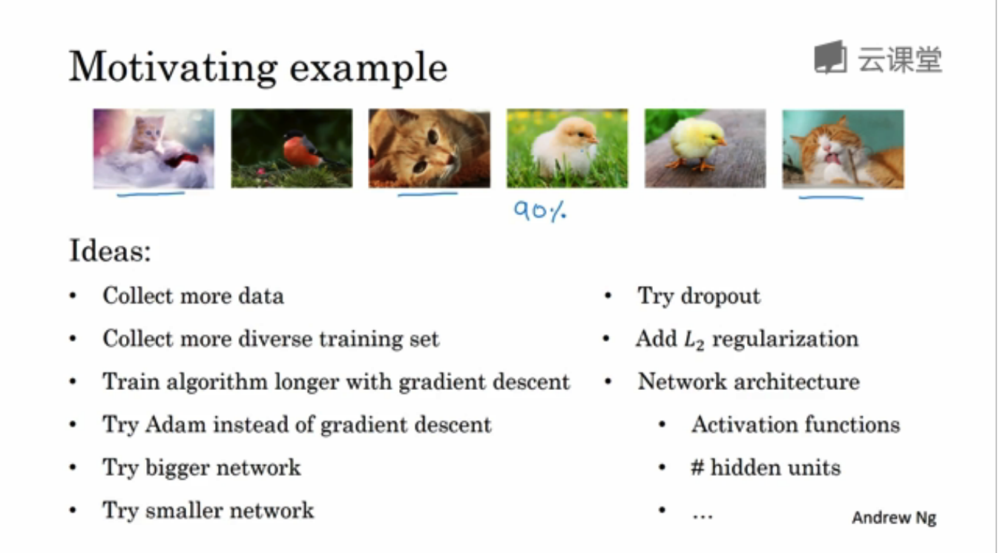
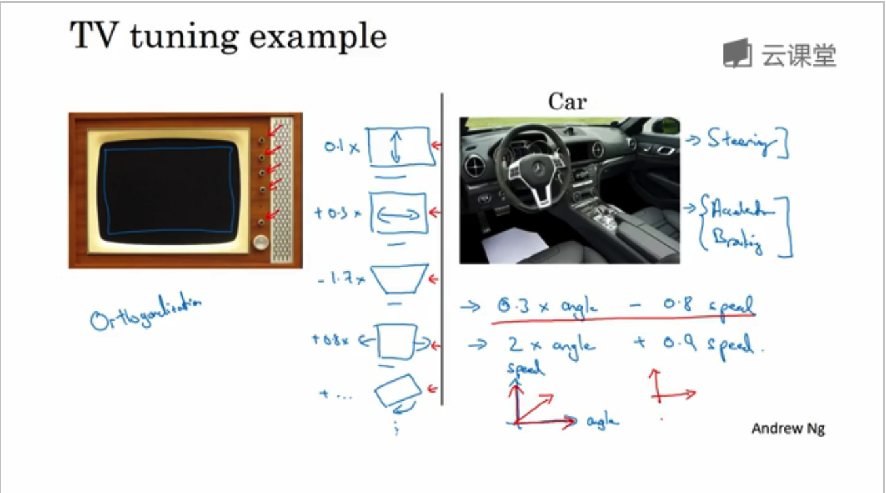
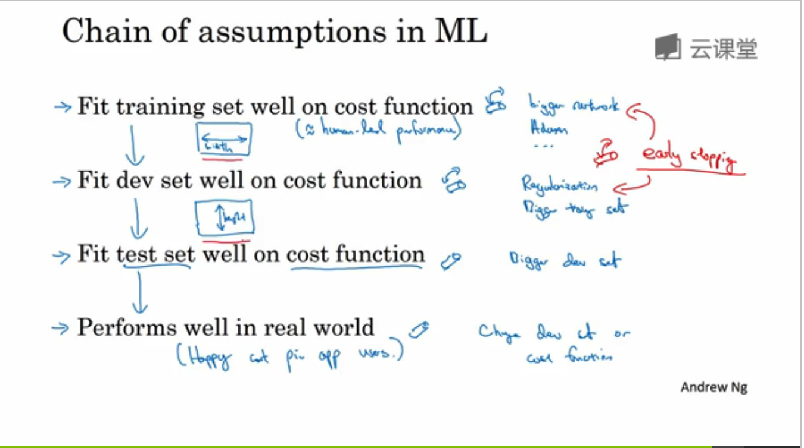
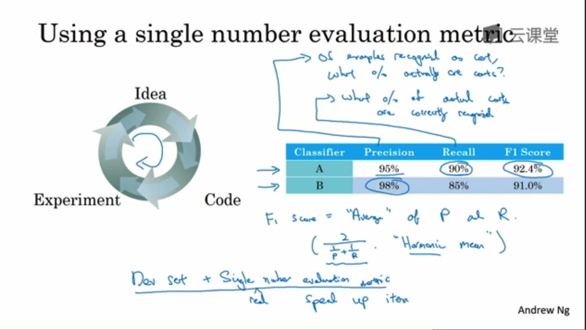
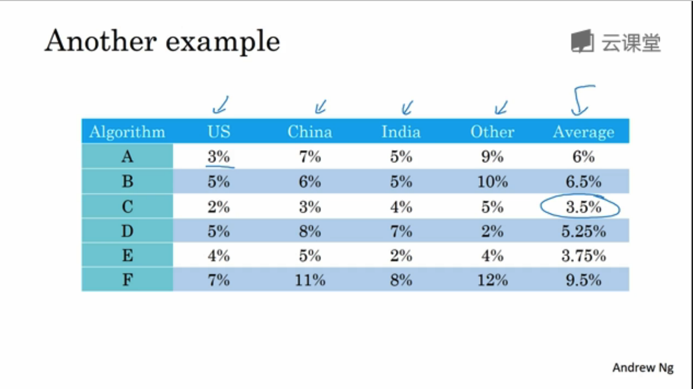
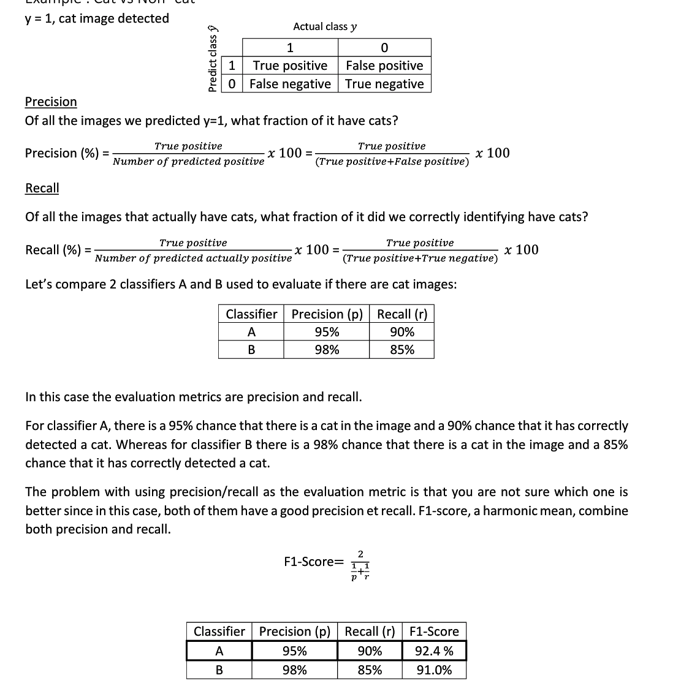
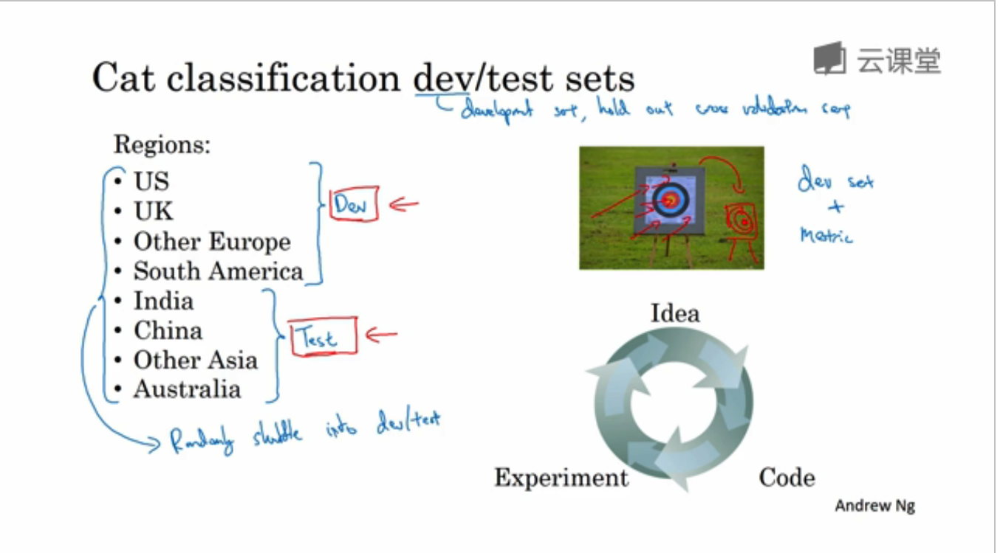
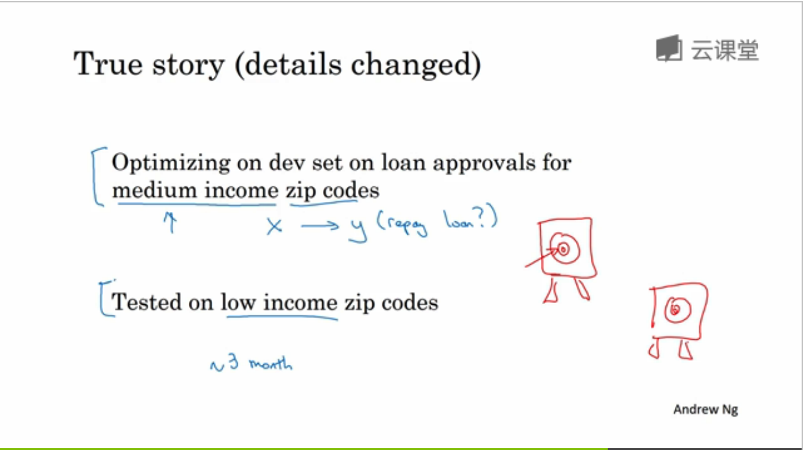
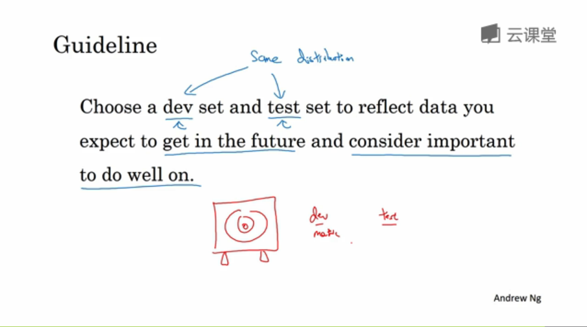

# deeplearning_notes

-----------------

## 第一周 机器学习（ML）策略（1）

### 1.1 为什么是 ML 策略

* 如果结果不满意，有好多方法可以调整。ml策略指引你朝着最有效的方法调整。

### 1.2 正交化

`orthogonalization`
* 搭建建立机器学习系统的挑战之一是有太多参数，可尝试改变的太多。
* 正交化：知道应该调什么可达到效果。例如电视有各种调大小，宽度的旋钮。互成90度，各自控制不同的内容。 应该是先调好宽度，再调高度

* 要弄好，确保四件事情（按顺序依次调好）
	* 必先确保系统在训练集上得到的结果不错
	* 在开发集也能有好的表现dev
	* 在测试集也有好的表现
	* 在实际使用中也能让用户满意
* 一般不用early stopping，因为它能同时影响两件事情。（就像一个按钮同时影响调电视的宽度和高度）

### 1.3 单一数字评估指标

* 有一个`single number evaluation metric`，调整会更好。
*  `precision` `recall`. 查准率/查全率。。评估指标
*  查准：你识别出真猫的数量上，有多少是真的真。
*  查全率：在真的是真猫的数量上，你能正确识别出多少百分比
* 问题来了，假设只有A分类器的precisions。和b分类器的recall，你就不能判断两个哪个更好？有两个评估指标就很难判断多个分类器哪个更好。你需要找到一个新的评估指标。`F1` 大概是p和r 的调和平均值

### 1.4 满足和优化指标

* 要把所有你顾及的东西组成一个single number evaluation 并不容易，所以设立满足和优化指标很重要（satisficing and optimizing metrics）
* 例如在运行速度不大于100ms下嘴好的accuracy。这样accuracy就是优化指标，不大于1000ms就是满足指标。
* 设置一个优化指标，其它都是满足指标，只要她们达到一定的阀值，你不在乎超过阀值的结果 。只管尽量优化优化指标

### 1.5 训练 / 开发 / 测试集划分

* dev set(develop set 开发集 或者叫交叉检验集)／test set
* 开发集和metric。就是你定下的目标去评估不同分类器，选最好的。
* 开发集和测试集一定要来自相同的目标，如果来自不同的目标，就是让你的团队花几个月尝试逼近靶心，但结果你却说测试时我要移动靶心。

* 选择dev集和test集时要选择相同分布，同一个目标。

### 1.6 开发集合测试集的大小

* 在机器学习早期，这样份很合理。但在深度学习，因为书 

### 1.7 什么时候该改变开发 / 测试集和指标

### 1.8 为什么是人的表现

### 1.9 可避免偏差

### 1.10 理解人的表现

### 1.11 超过人的表现

### 1.12 改善你的模型的表现

## 第二周 机器学习（ML）策略（2）

### 2.1 进行误差分析

### 2.2 清楚标注错误的数据

### 2.3 快速搭建你的第一个系统，并进行迭代

### 2.4 在不同的划分上进行训练并测试

### 2.5 不匹配数据划分的偏差和方差

### 2.6 定位数据不匹配

### 2.7 迁移学习

### 2.8 多任务学习

### 2.9 什么是端到端的深度学习

### 2.10 是否要使用端到端的深度学习
