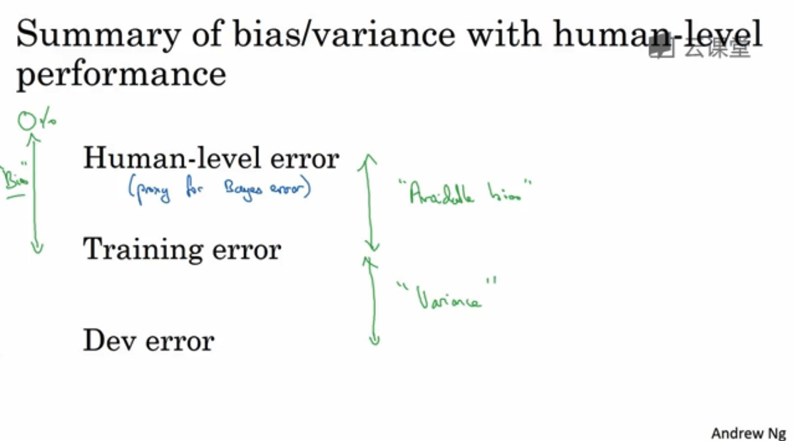

# deeplearning_notes

-----------------

## 第一周 机器学习（ML）策略（1）

### 1.1 为什么是 ML 策略

* 如果结果不满意，有好多方法可以调整。ml策略指引你朝着最有效的方法调整。

### 1.2 正交化

`orthogonalization`
* 搭建建立机器学习系统的挑战之一是有太多参数，可尝试改变的太多。
* 正交化：知道应该调什么可达到效果。例如电视有各种调大小，宽度的旋钮。互成90度，各自控制不同的内容。 应该是先调好宽度，再调高度

* 要弄好，确保四件事情（按顺序依次调好）
	* 必先确保系统在训练集上得到的结果不错
	* 在开发集也能有好的表现dev
	* 在测试集也有好的表现
	* 在实际使用中也能让用户满意
* 一般不用early stopping，因为它能同时影响两件事情。（就像一个按钮同时影响调电视的宽度和高度）

### 1.3 单一数字评估指标

* 有一个`single number evaluation metric`，调整会更好。
*  `precision` `recall`. 查准率/查全率。。评估指标
*  查准：你识别出真猫的数量上，有多少是真的真。
*  查全率：在真的是真猫的数量上，你能正确识别出多少百分比
* 问题来了，假设只有A分类器的precisions。和b分类器的recall，你就不能判断两个哪个更好？有两个评估指标就很难判断多个分类器哪个更好。你需要找到一个新的评估指标。`F1` 大概是p和r 的调和平均值

### 1.4 满足和优化指标

* 要把所有你顾及的东西组成一个single number evaluation 并不容易，所以设立满足和优化指标很重要（satisficing and optimizing metrics）
* 例如在运行速度不大于100ms下嘴好的accuracy。这样accuracy就是优化指标，不大于1000ms就是满足指标。
* 设置一个优化指标，其它都是满足指标，只要她们达到一定的阀值，你不在乎超过阀值的结果 。只管尽量优化优化指标

### 1.5 训练 / 开发 / 测试集划分

* dev set(develop set 开发集 或者叫交叉检验集)／test set
* 开发集和metric。就是你定下的目标去评估不同分类器，选最好的。
* 开发集和测试集一定要来自相同的目标，如果来自不同的目标，就是让你的团队花几个月尝试逼近靶心，但结果你却说测试时我要移动靶心。

* 选择dev集和test集时要选择相同分布，同一个目标。

### 1.6 开发集合测试集的大小

* 在机器学习早期，这样份很合理。但在深度学习，因为需要数据太多。所以现在流行把大量数据分到训练集，然后少量数据分到开发集和测试集。

### 1.7 什么时候该改变开发 / 测试集和指标

* 设置了开发集和评估指标。但在过程中，可能发现目标的位置放错了。这种时候应该移动目标。
* 不要在没有开发集和评估指标的设定前跑太久程序。没意义。

### 1.8 为什么是人的表现

* 超过人类的水平，用原有的策略就没办法提升。

### 1.9 可避免偏差

* 贝叶斯误差（人类误差）与训练误差之间，就是可避免误差（avoidable error）。
* 可避免误差小的话，就没办法再提升训练误差效率。只能尽力减少dev的误差率。

### 1.10 理解人的表现

* 人类水平（human-level performance）
* 用人类水平误差 来估计贝叶斯误差

* 什么是人类水平误差？
* 普通人／普通医生／经验医生／一群经验医生讨论后。
* 如果你想替代或估计贝叶斯误差，那么假如一队经验丰富的医生讨论和辩论后得到0.5%，贝叶斯误差小于等于0.5%。（最优误差在0.5%以下）
* 使用0.5%估计贝叶斯误差。所以将人类水平误差设为0.5%
* (使用人类误差来估计贝叶斯误差！！贝叶斯误差的替代品)

* 人类水平误差（贝叶斯误差的代替品）---（可避免误差）--训练误差-----dev误差
* 当训练误差接近人类水平误差时（即可避免误差很小时），你越难判断是bias还是variances。如果可避免误差大时，将注意力放在bias或variance上。

### 1.11 超过人的表现

* 一旦超过人类水平误差，就无明确的前进方向。
* 但是并不意味着你不能前进，但现有的工具就没那么好用了。

* 现在有好多机器学习项目已经超越人类水平了
* 以上的都是从结构化数据获取的问题。从自然感知获取的数据目前还很难超越人类

### 1.12 改善你的模型的表现

* 第一件事你可以做好的是：你的算法对训练集的拟合很好（可避免误差很低）
* 第二件事：在训练中做得好，然后推广到开发集和测试集也很好。（方差不大）
* 以上就有两个正交化按钮。

* 总结
* avoidable bias=[训练更大的网络／更好的优化算法／其它结构和参数搜查]
* variance=[更多数据／正则化（l2/dropout/data_arguatation）]
* 参数检索

## 第二周 机器学习（ML）策略（2）

### 2.1 进行误差分析

* 误差分析：学习算法还未达到人类的表现，人工检查一下算法犯的错误。
* 例子：猫分类器。90%准确率，有10%误差率。
* 误差分析流程：1、收集100个错误标记的开发集（dev）例子。2、计算有多少是狗。。。。如果100个里有5%是狗，那解决狗的问题最大性能都是下降到9.5%误差率。
* 人工误差分析可以节省大量时间，更快知道问题在哪。

* 误差分析评估表
* 上述三大问题：狗分类器识别了猫／大型猫科动物／模糊图片
* 用电子表格做。人工分析。可以判断下一步往哪个方向处理。如图。处理大型猫科动物可以有43的性能提升空间

* 总结：进行误差分析，在开发集或者测试集找一组错误例子。观察错误标记的例子，看看假阳性和假阴性。统计属于不同错误类型。

### 2.2 清楚标注错误的数据

* 标记错误影响大就处理，影响不大不用处理。和误差评估表一样
* 修正训练集的标签相对没那么重要。修正开发集和测试集。

### 2.3 快速搭建你的第一个系统，并进行迭代

* 构建快速而dirty的实现，然后用来帮你找到改善系统要优先处理的方向。
* 快速建立第一个系统，然后迭代

### 2.4 在不同的划分上进行训练并测试

### 2.5 不匹配数据划分的偏差和方差

### 2.6 定位数据不匹配

### 2.7 迁移学习

### 2.8 多任务学习

### 2.9 什么是端到端的深度学习

### 2.10 是否要使用端到端的深度学习
