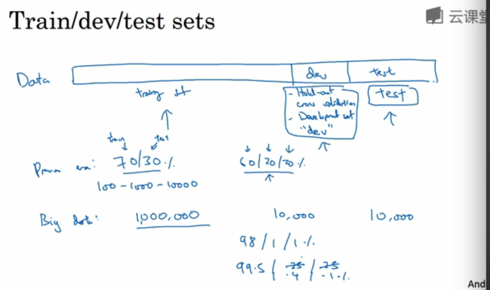
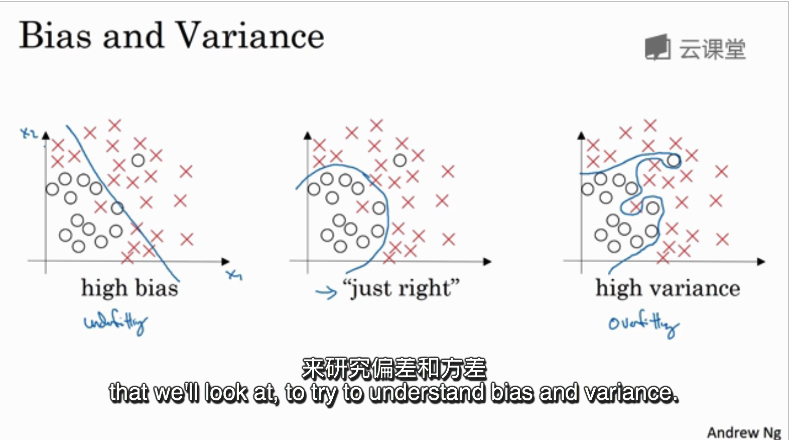
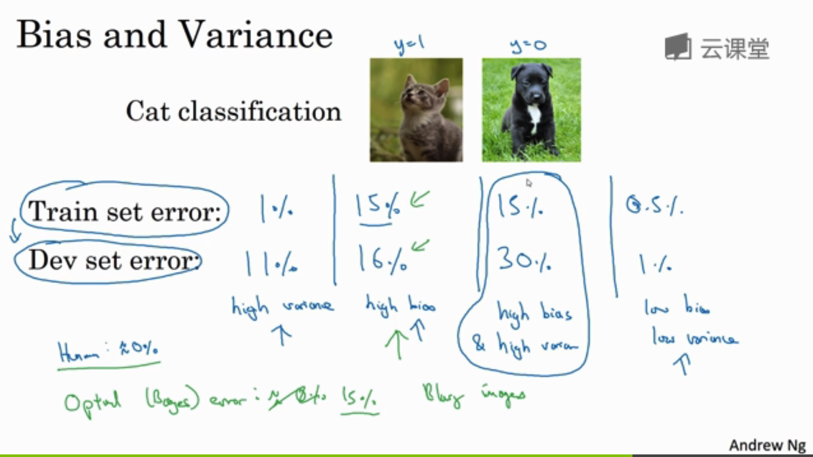

# deeplearning_notes

-----------------

##第一周 深度学习的实用层面

### 1.1 训练 / 开发 / 测试集

- 训练集、验证集、测试集

### 1.2 偏差 / 方差

### 1.3 机器学习基础

### 1.4 正则化

### 1.5 为什么正则化可以减少过拟合？

### 1.6 Dropout 正则化

### 1.7 理解 Dropout

### 1.8 其他正则化方法

### 1.9 正则化输入

### 1.10 梯度消失与梯度爆炸

### 1.11 神经网络的权重初始化

### 1.12 梯度的数值逼近

### 1.13 梯度检验

### 1.14 关于梯度检验实现的注记

##第二周 优化算法

### 2.1 Mini-batch 梯度下降法

### 2.2 理解 mini-batch 梯度下降法

### 2.3 指数加权平均

### 2.4 理解指数加权平均

### 2.5 指数加权平均的偏差修正

### 2.6 动量梯度下降法

### 2.7 RMSprop

### 2.8 Adam 优化算法

### 2.9 学习率衰减

### 2.10 局部最优的问题

##第三周 超参数调试、Batch正则化和程序框架

### 3.1 调试处理

### 3.2 为超参数选择合适的范围

### 3.3 超参数训练的实践：Pandas VS Caviar

### 3.4 正则化网络的激活函数

### 3.5 将 Batch Norm 拟合进神经网络

### 3.6 Batch Norm 为什么奏效？

### 3.7 测试时的 Batch Norm

### 3.8 Softmax 回归

### 3.9 训练一个 Softmax 分类器

### 3.10 深度学习框架

### 3.11 TensorFlow

