# deeplearning_notes

-----------------

##第一周 深度学习的实用层面

### 1.1 训练 / 开发 / 测试集

- 训练集、验证集、测试集

### 1.2 偏差 / 方差

- high bias :underfit
- high variance :overfit

### 1.3 机器学习基础

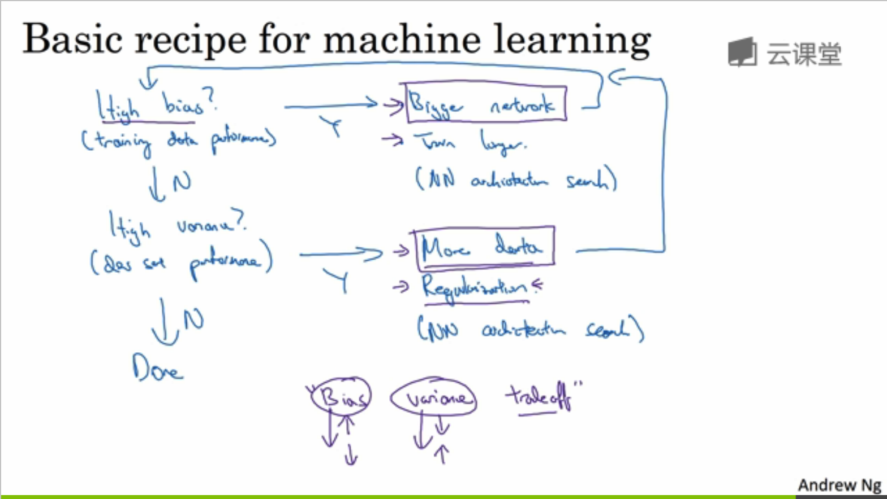

- 高bias(underfit)，增强网络，选择nn
- 高variance（overfit） ，更多数据／正则化(其实就是去掉一些影响因子的作用)

### 1.4 正则化

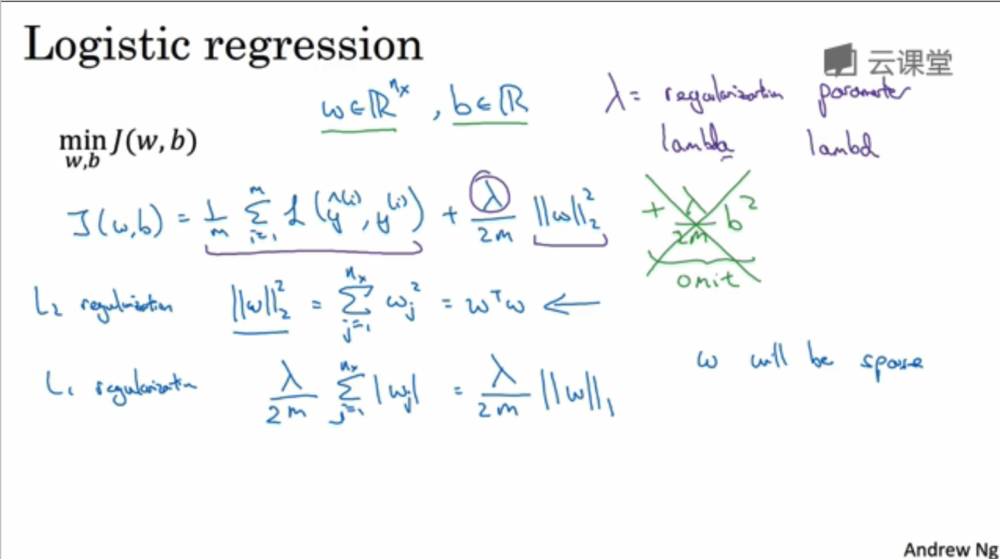

- l2正则化：+lamda/2m  *||w||_2^2
- l1正则化：+lamda/2m. *||w||_1 

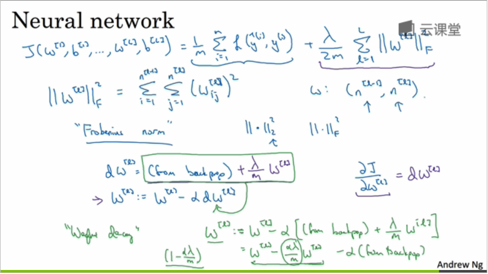

- l2 系数正则化，又称权重衰减 
- 归根到底就是对单个w的导数*（1-d(lamda)/m）

### 1.5 为什么正则化可以减少过拟合？

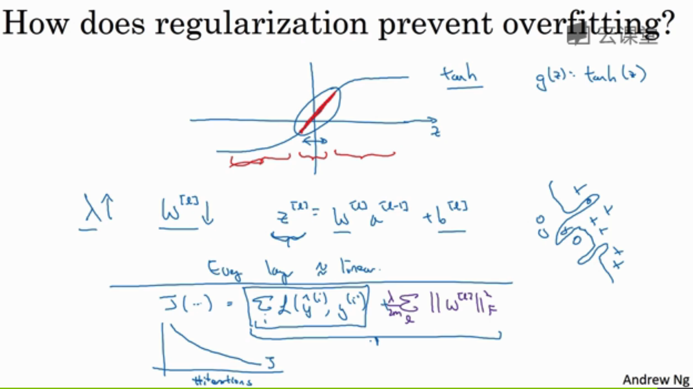

- z值取值范围缩小，往线性方程方向发展。

### 1.6 Dropout 正则化

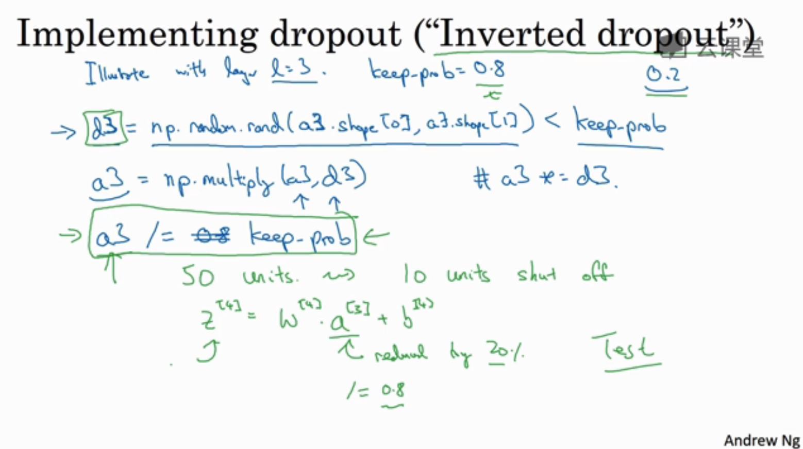

- keep-prob保留概率
-  预测时不需要dropout

### 1.7 理解 Dropout

### 1.8 其他正则化方法

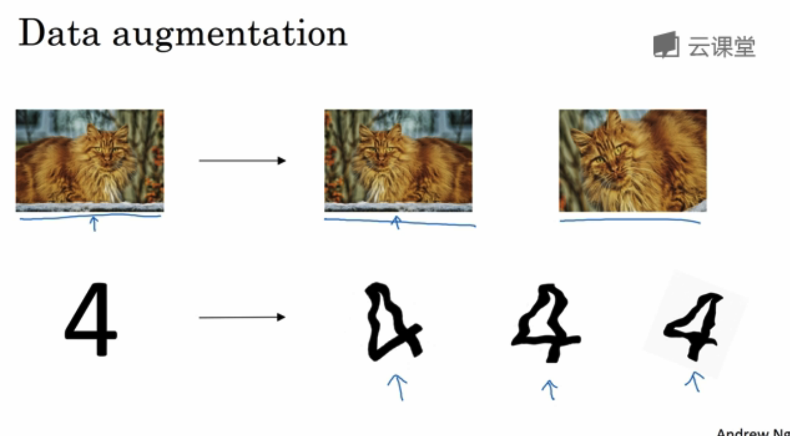

- 数据增广

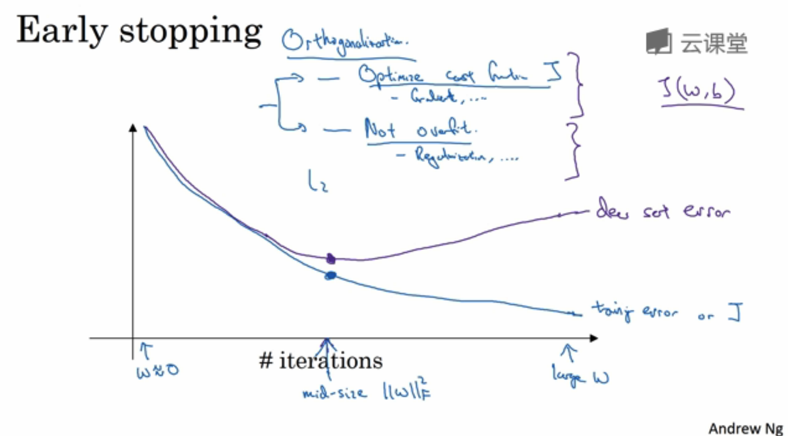

- early stopping
### 1.9 正则化输入

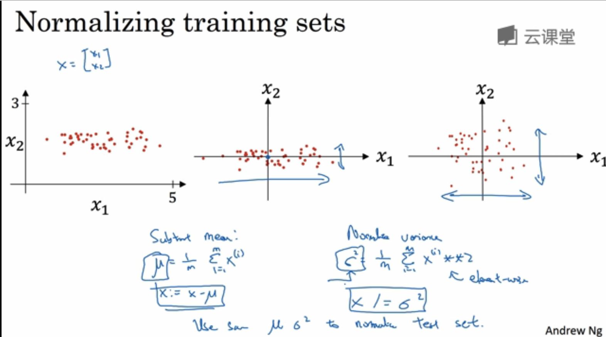

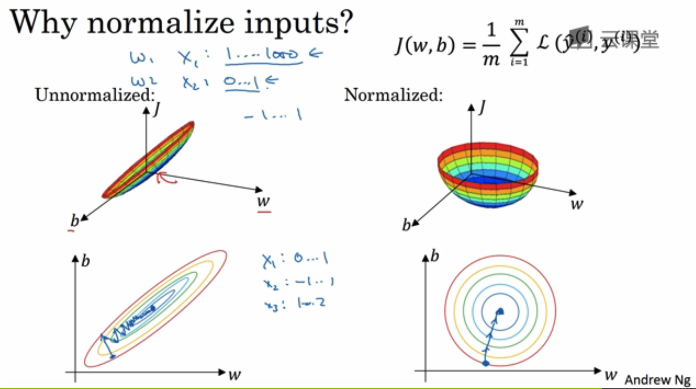

- 归一化

### 1.10 梯度消失与梯度爆炸

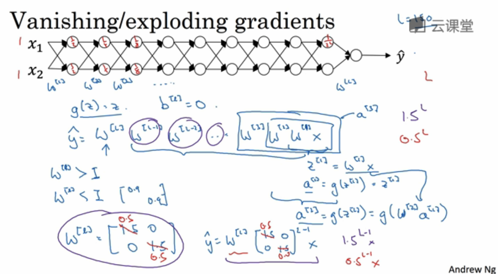

- 权重只比1（单位矩阵）大一点，深度神经的激活函数将呈爆炸式增长。
- 如果W只比1略小一点，函数将以指数式递减

### 1.11 神经网络的权重初始化

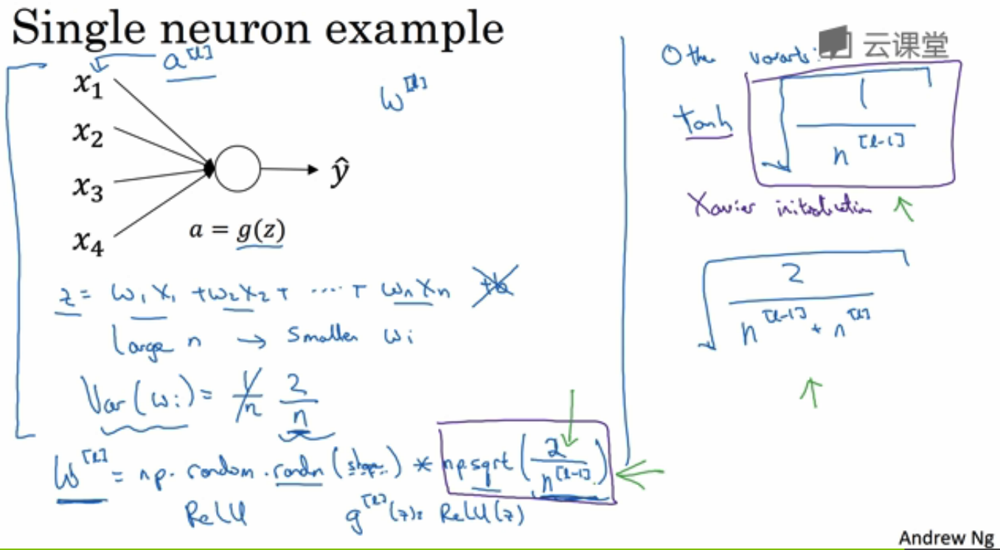

- 目的。降低梯度消失或爆炸现象。
- 使w不会比1大很多或小很多。所以初始化w*（1/n）
- W[l]=np.random.randn(shape)*np.sqrt(2/n[l-1])
- xavier初始化。除了使用relu，野适用tanh

### 1.12 梯度的数值逼近

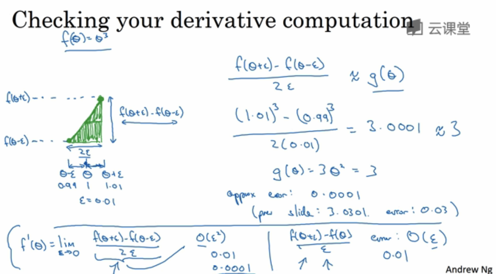

- 这是梯度检验的前提
- 已知双边误差f(x+&)-f(x-&)/2*&  与f(x)的导数g(x)近似逼近。。相差误差O(&)

### 1.13 梯度检验

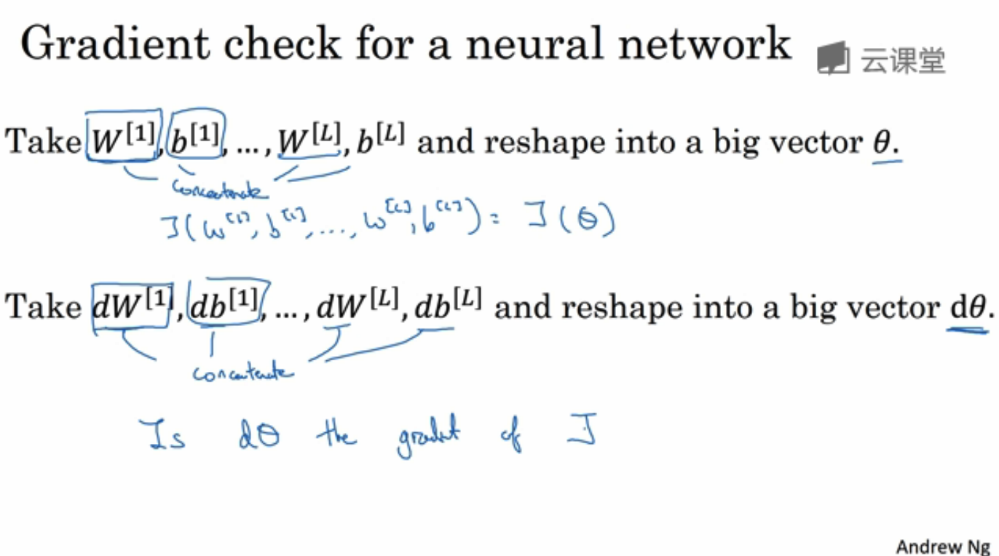

- 目的：检验backprop的实施是否正确
- J(w[1],b[1],w[2]......)=J(sigma)
- dW[1]/db[1]/dW[2].....=dsigma
- J(sigma).shape=dJ(sigma).shape
- dsigma===dJ(sigma)之间的关系？

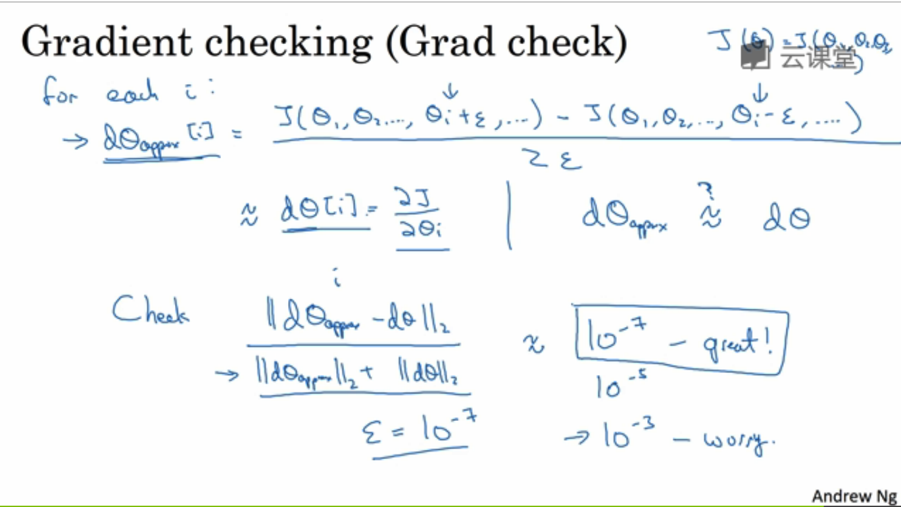

- 因为，计算dsigma_appro[i] 约等于 dsigma[i]
- 检查sum(dsigma_appro-dsigma)^2

### 1.14 关于梯度检验实现的注记

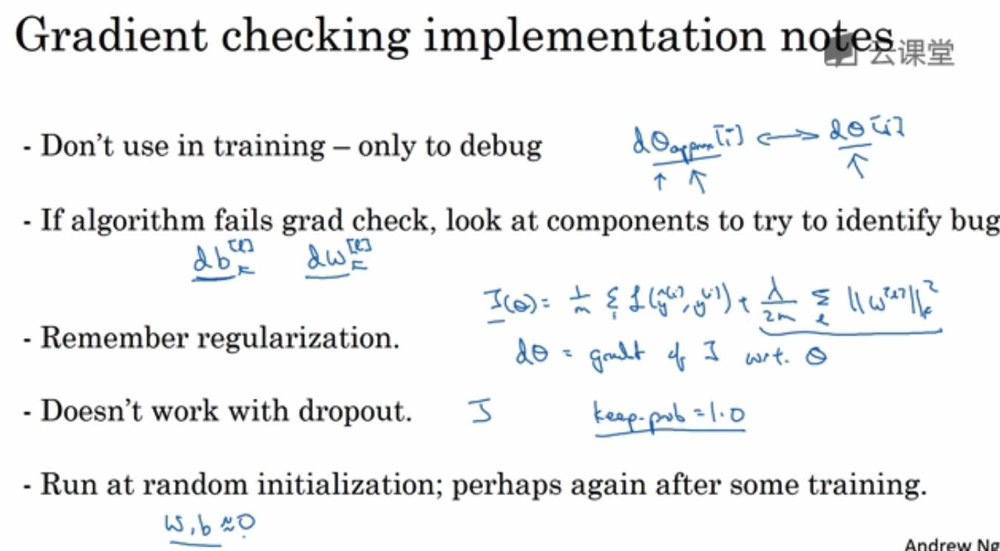

##第二周 优化算法

### 2.1 Mini-batch 梯度下降法

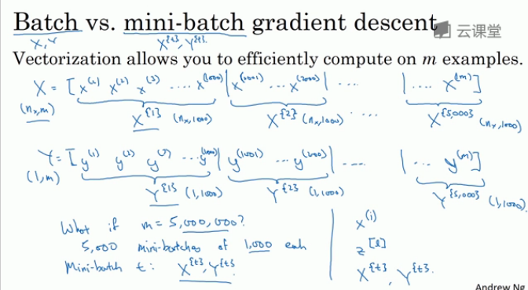

### 2.2 理解 mini-batch 梯度下降法

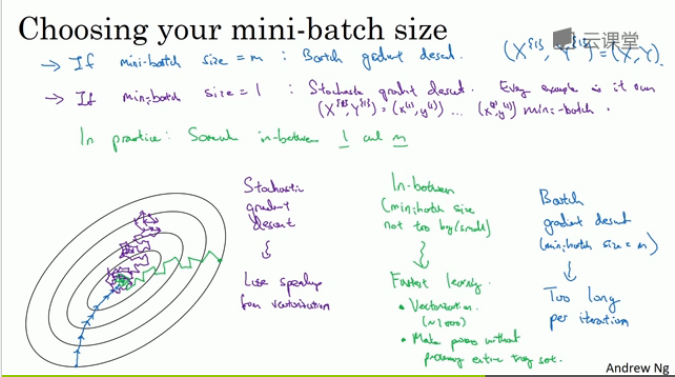

* minibatch_size=1.`随机梯度下降（SGD）`。每次只计算一组数据。失去所有向量化带来的加速
* minibatch_size=m。`batch梯度下降`。少于2000个数据时可以用，但当数据量多的时候计算速度很慢。
* minibatch_size=64/128/256/512。`minibatch梯度下降`。2的平方最适合。一般在64至512之间

### 2.3 指数加权平均

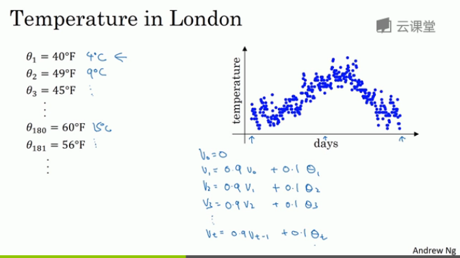

* 某天的V=前一天的V*0.9+当日温度的0.1
* beta*v_0+cima*v_1
* 过去1/(1-beta)天的平均值走势图。
* 比如beta=0.9.。加权平均即系过去10天的走势

### 2.4 理解指数加权平均

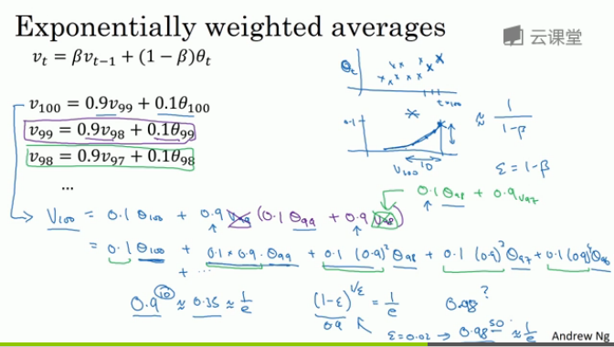

* 0.1*beta_100+0.1*0.9*beta_99+0.1*0.9^2*beta_98………………0.1*beta_1+0.1*0.9^99*beta_1
* 当beta=0.9时，0.9的10次方大约等于1/e，仿佛在计算一个指数加权平均数。只关注过去10天的数据。因为10天后，权重下降到不到当日权重的三分之一
* 当beta=0.98时，0.98的50次方大约等于1/e,即下降到当日权重的三分之一以下
* 由此得到公式。平均了1/(1-beta)天数

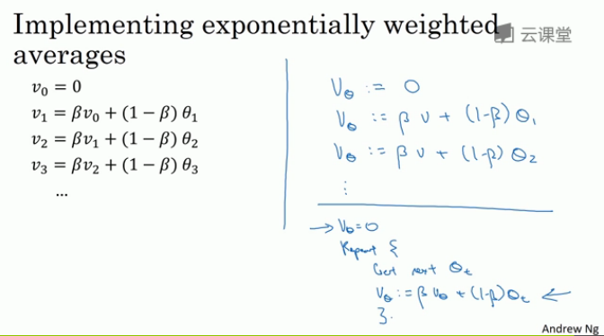

### 2.5 指数加权平均的偏差修正

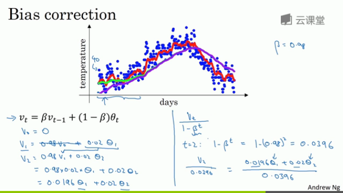

* 第一天、前两天、前面数值的预测不准。
* 使用v/(1-beta**t). t是第几个数
* 比如t=2:  1-beta**t=1-(0.98)**2=0.0396
* 当t很大的时候，就无用

### 2.6 动量梯度下降法

### 2.7 RMSprop

### 2.8 Adam 优化算法

### 2.9 学习率衰减

### 2.10 局部最优的问题

##第三周 超参数调试、Batch正则化和程序框架

### 3.1 调试处理

### 3.2 为超参数选择合适的范围

### 3.3 超参数训练的实践：Pandas VS Caviar

### 3.4 正则化网络的激活函数

### 3.5 将 Batch Norm 拟合进神经网络

### 3.6 Batch Norm 为什么奏效？

### 3.7 测试时的 Batch Norm

### 3.8 Softmax 回归

### 3.9 训练一个 Softmax 分类器

### 3.10 深度学习框架

### 3.11 TensorFlow

