# deeplearning_notes

-----------------

##第一周 深度学习的实用层面

### 1.1 训练 / 开发 / 测试集

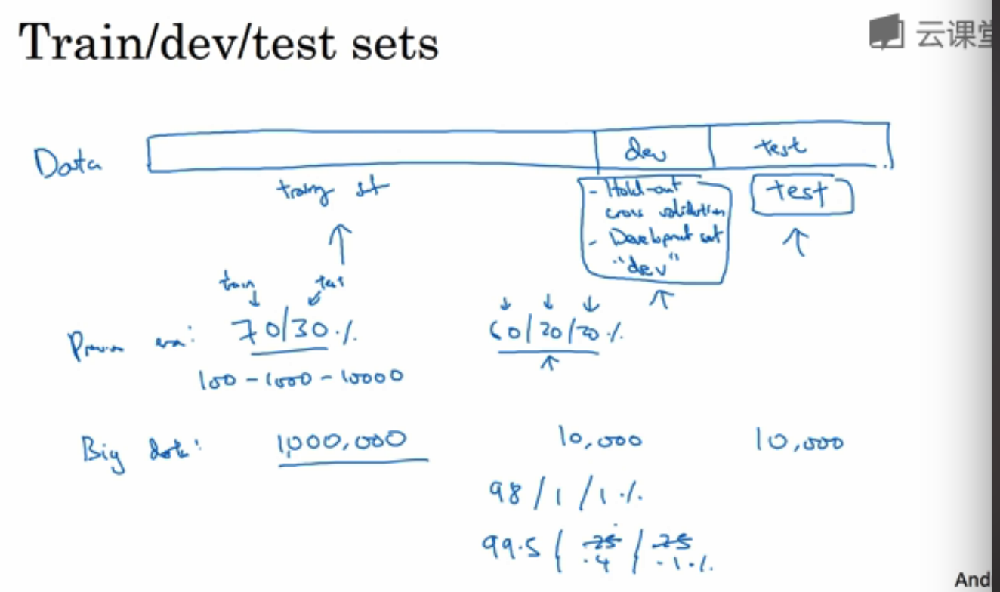

- 训练集、验证集、测试集

### 1.2 偏差 / 方差

- high bias :underfit
- high variance :overfit

### 1.3 机器学习基础

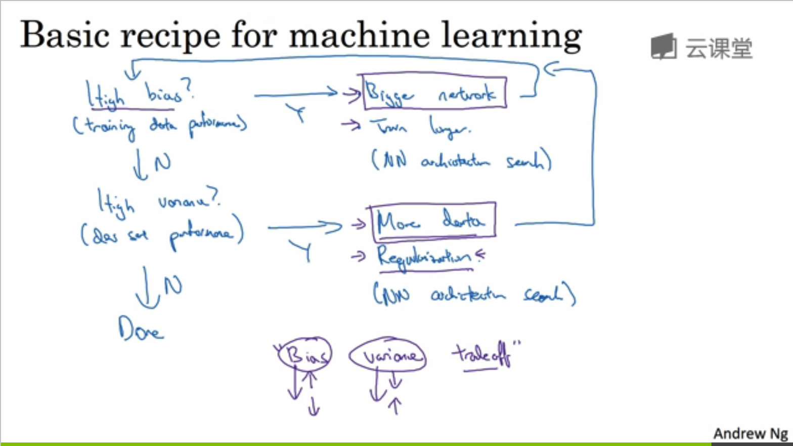

- 高bias(underfit)，增强网络，选择nn
- 高variance（overfit） ，更多数据／正则化(其实就是去掉一些影响因子的作用)

### 1.4 正则化

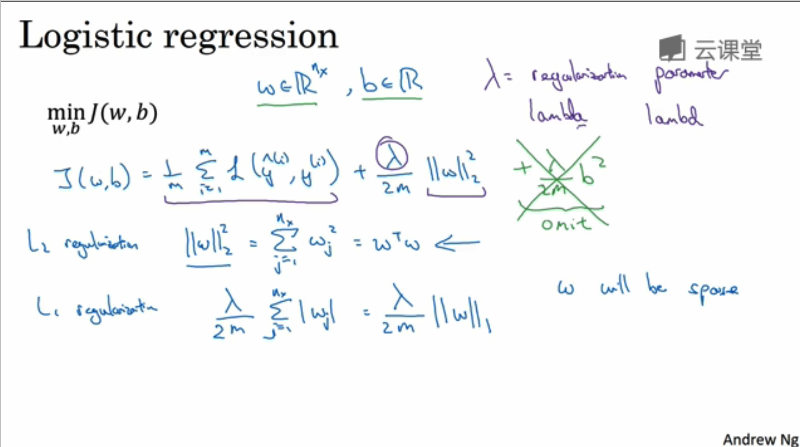

- l2正则化：+lamda/2m  *||w||_2^2
- l1正则化：+lamda/2m. *||w||_1 

- l2 系数正则化，又称权重衰减 
- 归根到底就是对单个w的导数*（1-d(lamda)/m）

### 1.5 为什么正则化可以减少过拟合？

- z值取值范围缩小，往线性方程方向发展。

### 1.6 Dropout 正则化

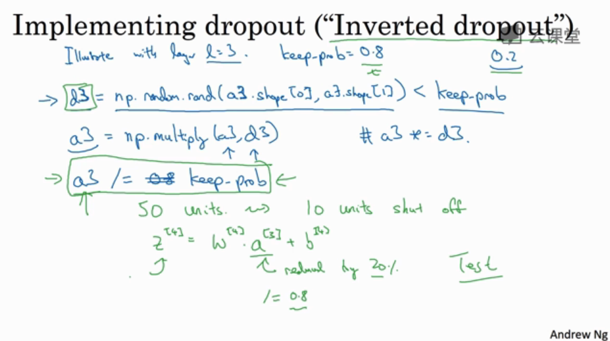

- keep-prob保留概率
-  预测时不需要dropout

### 1.7 理解 Dropout

### 1.8 其他正则化方法

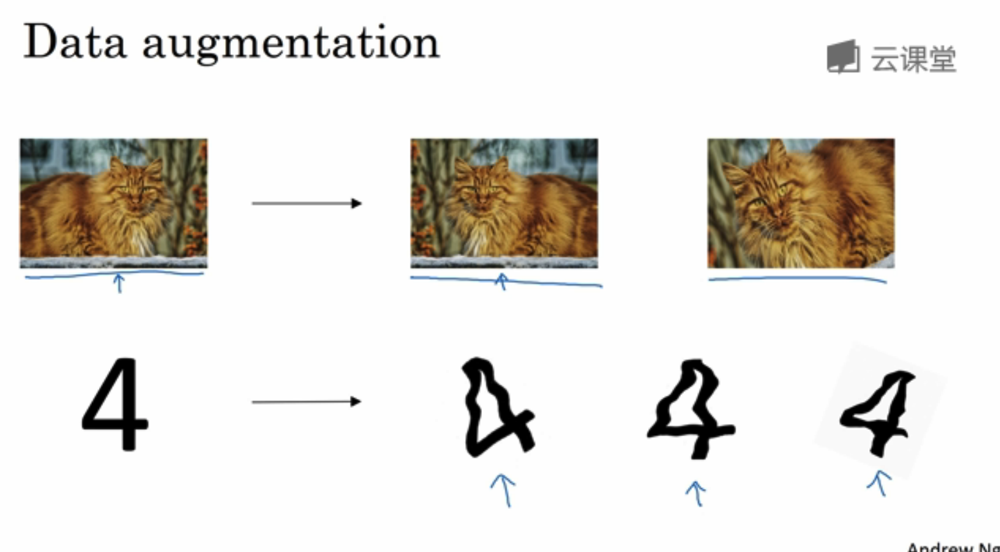

- 数据增广

- early stopping
### 1.9 正则化输入

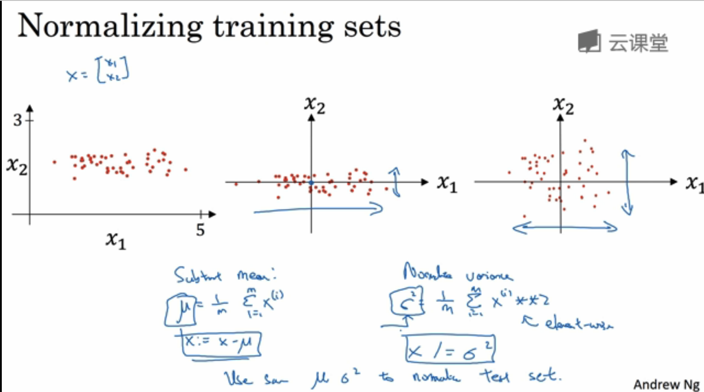

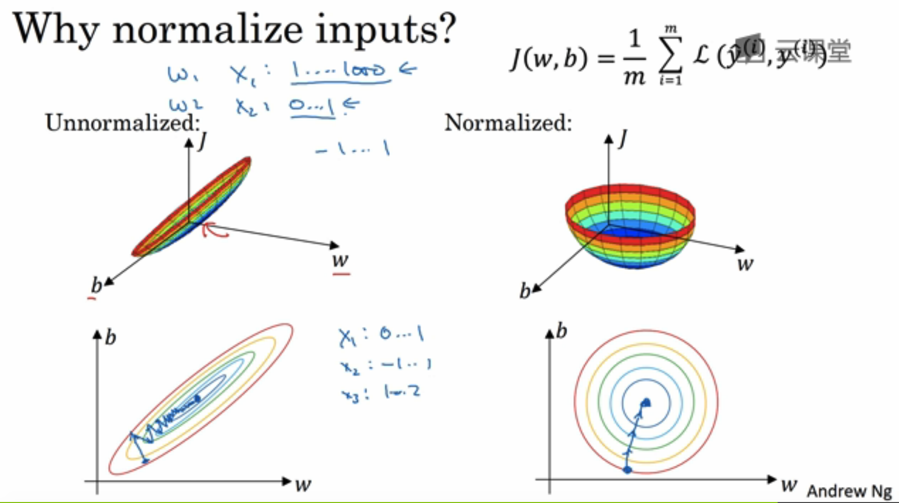

- 归一化

### 1.10 梯度消失与梯度爆炸

- 权重只比1（单位矩阵）大一点，深度神经的激活函数将呈爆炸式增长。
- 如果W只比1略小一点，函数将以指数式递减

### 1.11 神经网络的权重初始化

- 目的。降低梯度消失或爆炸现象。
- 使w不会比1大很多或小很多。所以初始化w*（1/n）
- W[l]=np.random.randn(shape)*np.sqrt(2/n[l-1])
- xavier初始化。除了使用relu，野适用tanh

### 1.12 梯度的数值逼近

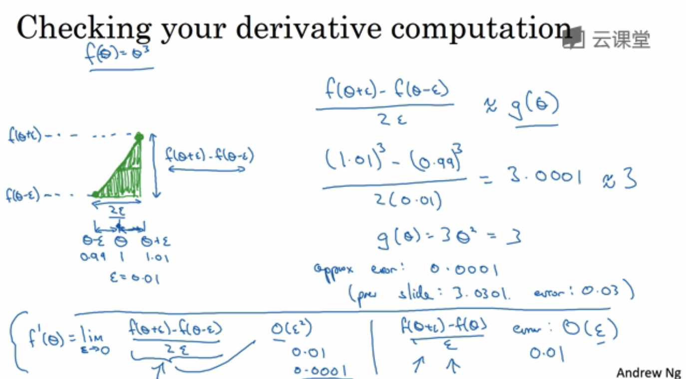

- 这是梯度检验的前提
- 已知双边误差f(x+&)-f(x-&)/2*&  与f(x)的导数g(x)近似逼近。。相差误差O(&)

### 1.13 梯度检验

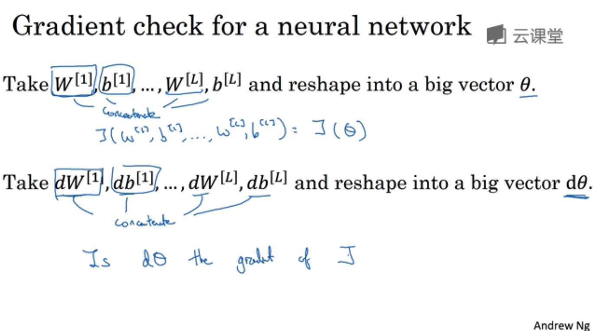

- 目的：检验backprop的实施是否正确
- J(w[1],b[1],w[2]......)=J(sigma)
- dW[1]/db[1]/dW[2].....=dsigma
- J(sigma).shape=dJ(sigma).shape
- dsigma===dJ(sigma)之间的关系？

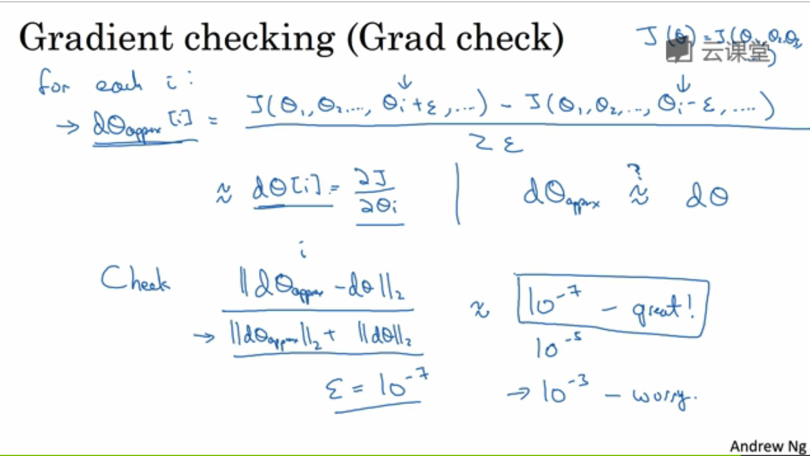

- 因为，计算dsigma_appro[i] 约等于 dsigma[i]
- 检查sum(dsigma_appro-dsigma)^2

### 1.14 关于梯度检验实现的注记

##第二周 优化算法

### 2.1 Mini-batch 梯度下降法

* 使用花括号代表第几个batch。
* 如果m=5,000,000。 有5000个minibatch 每一个minibatch有1000个数

### 2.2 理解 mini-batch 梯度下降法

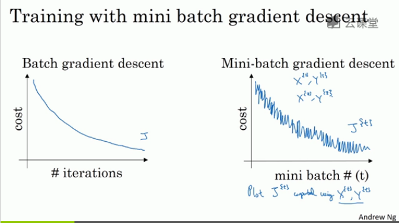

* minibatch_size=1.`随机梯度下降（SGD）`。每次只计算一组数据。失去所有向量化带来的加速
* minibatch_size=m。`batch梯度下降`。少于2000个数据时可以用，但当数据量多的时候计算速度很慢。
* minibatch_size=64/128/256/512。`minibatch梯度下降`。2的平方最适合。一般在64至512之间

### 2.3 指数加权平均

* 某天的V=前一天的V*0.9+当日温度的0.1
* beta*v_0+cima*v_1
* 过去1/(1-beta)天的平均值走势图。
* 比如beta=0.9.。加权平均即系过去10天的走势

### 2.4 理解指数加权平均

* 0.1*beta_100+0.1*0.9*beta_99+0.1*0.9^2*beta_98………………0.1*beta_1+0.1*0.9^99*beta_1
* 当beta=0.9时，0.9的10次方大约等于1/e，仿佛在计算一个指数加权平均数。只关注过去10天的数据。因为10天后，权重下降到不到当日权重的三分之一
* 当beta=0.98时，0.98的50次方大约等于1/e,即下降到当日权重的三分之一以下
* 由此得到公式。平均了1/(1-beta)天数

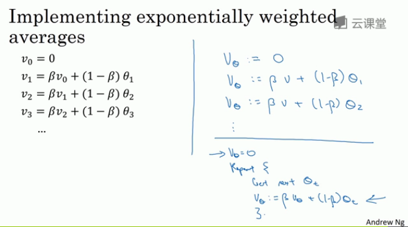

### 2.5 指数加权平均的偏差修正

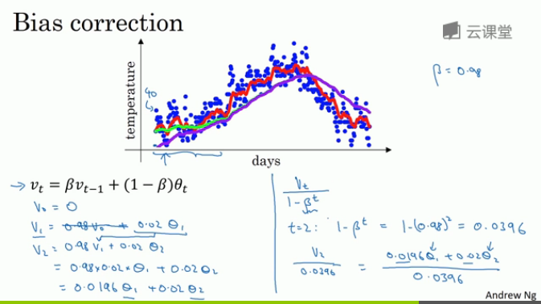

* 第一天、前两天、前面数值的预测不准。
* 使用v/(1-beta**t). t是第几个数
* 比如t=2:  1-beta**t=1-(0.98)**2=0.0396
* 当t很大的时候，就无用

### 2.6 动量梯度下降法

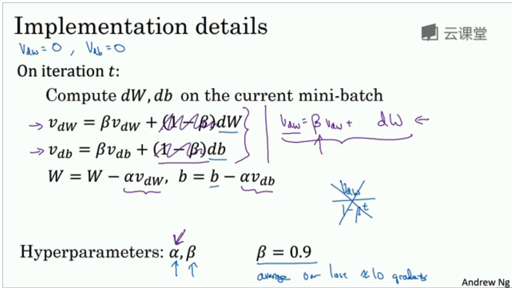

* momentum
	* Vdw=beta * Vdw + (1-beta) * Vdw
	* Vdb=beta * Vdb + (1-beta) * Vdw
	* W=W-alfa * Vdw
	* b=b-alfa * Vdb

### 2.7 RMSprop

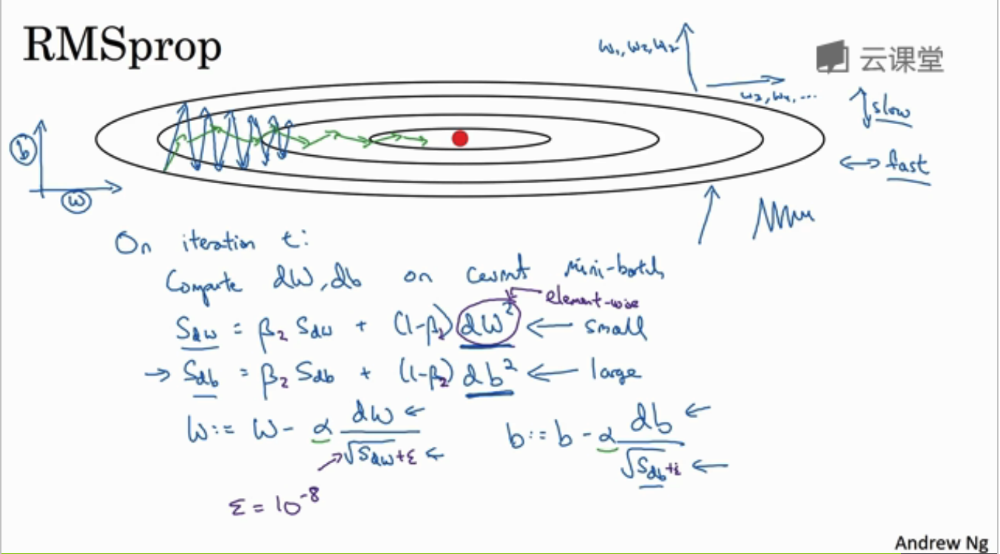

* RMSprop
	* Sdw=beta2 * Sdw + (1-beta2) * dw^2
	* Sdb=beta2 * Sdb + (1-beta2) * db^2
	* w:=w-alfa * dw/sqrt(Sdw+epsilon)
	* b:=b-alfa * db/sqrt(Sdb+epsilon)
* 设置epsilon是为了防止处以一个很小的数

### 2.8 Adam 优化算法

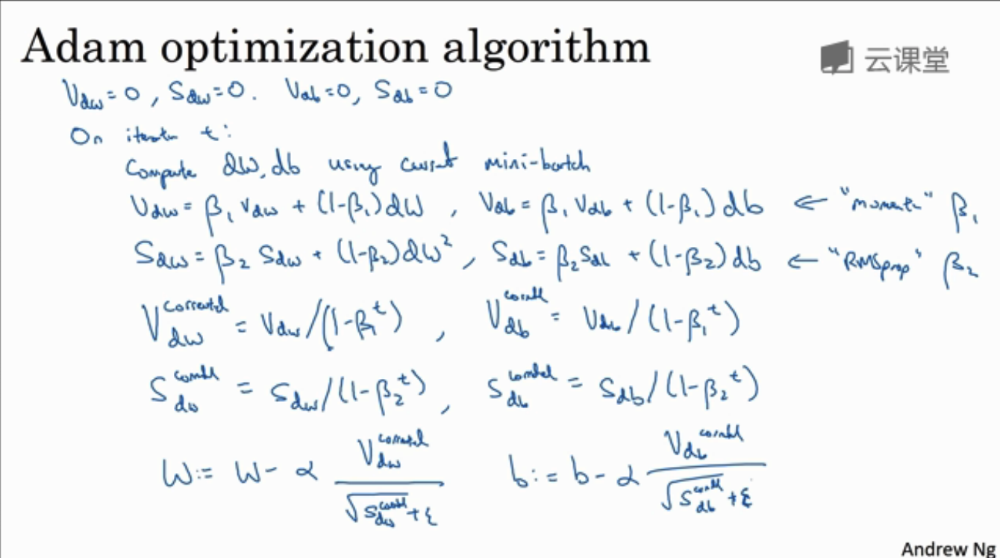

* Adam = momentum + RMSprop
	* Vdw=beta1 * Vdw + (1-beta1) * Vdw
	* Vdb=beta1 * Vdb + (1-beta1) * Vdw
	* Sdw=beta2 * Sdw + (1-beta2) * dw^2
	* Sdb=beta2 * Sdb + (1-beta2) * db^2
	* 修正后的
	* Vdw_=Vdw/(1-beta1^t)
	* Vdb_=Vdb/(1-beta1^t)
	* Sdw_=Sdw/(1-beta2^2)
	* Sdb_=Sdb/(1-beta2^2)

	* w:=w-alfa * Vdw_ /sqrt(Sdw_+epsilon)
	* b:=b-alfa * Vdb_ /sqrt(Sdb_+epsilon)

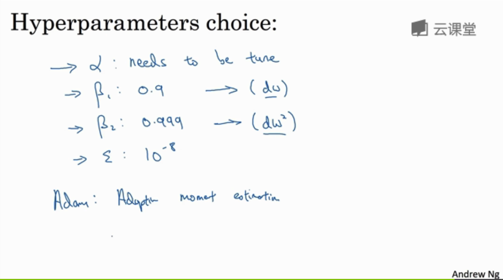

- 超参数分类
	* alfa
	* beta1:  0.9
	* beta2:	0.999
	* epsilon:	10^-8
* 调试建议：alfa经常需要调试，beta1\beta2一般使用缺散值，epsilon影响非常小并不需要设置他

### 2.9 学习率衰减

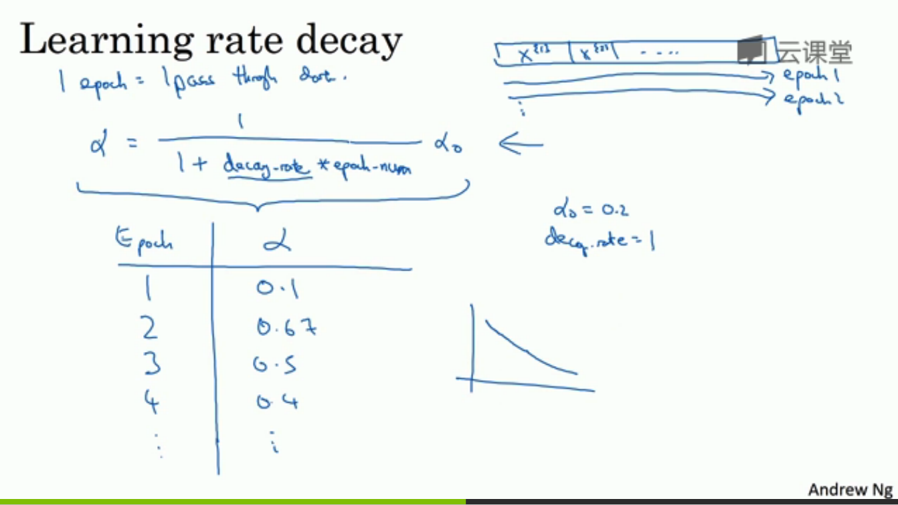

* minibatch的训练,为了逐步减少后面的batch的alfa。
* 针对batch的

* 学习率衰减方法1: alfa=alfa/(1+decay_rate*epoch_num)
* 学习率衰减方法2: 0.95^epoch_num *alfa    【exponentially decay】
* 学习率衰减方法3:k*alfa/sqrt(epoch_num)
* 学习率衰减方法4:离散
* 手动学习率衰减

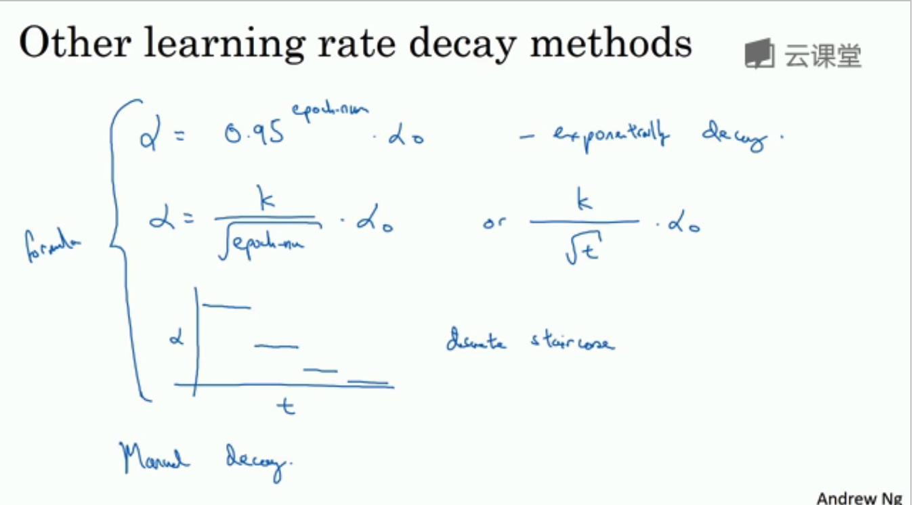

* 学习率衰减不是吴恩达尝试的要点。他更愿意设定一个固定的alfa，然后好好调整。
* 学习率衰减虽然可以加快训练的速度，但不是率先尝试的内容。

### 2.10 局部最优的问题

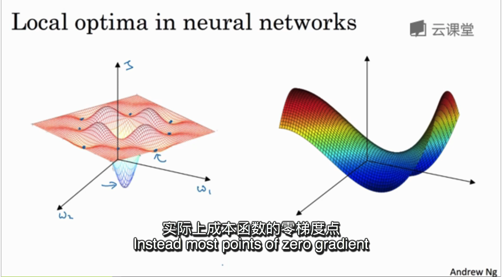

* 实际上，当梯度为0时，往往不是在local minimum。而是在鞍点saddle point。所以不用担心落到局部最优点。
* 高纬度，更有可能碰到鞍点。

##第三周 超参数调试、Batch正则化和程序框架

### 3.1 调试处理

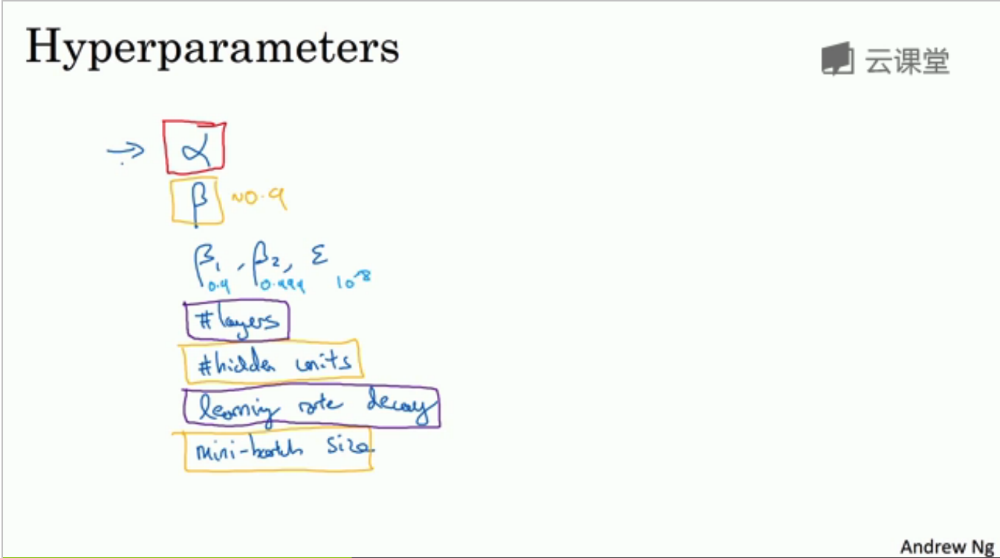

* 超参数有哪些？
	* 学习率alfa、beta（momentum）、beta1(RMSprop)、	beta2\epsilon(adam)
	* number of layers（层数）/number of hidden（hidden unit）（隐藏单元的数量）/
	* learning rate decay
	* mini-batch size

* 超参数调试优先顺序：
	* 以上嘴重要需要调试的是alfa学习率，除此外，momentum =0.9是很好的默认值。还会挑食minibatch大小。
	* 红色-》黄色-》紫色-》无色。 经常调超参数的重要程度顺序

* 如何选择超参数？：
	
	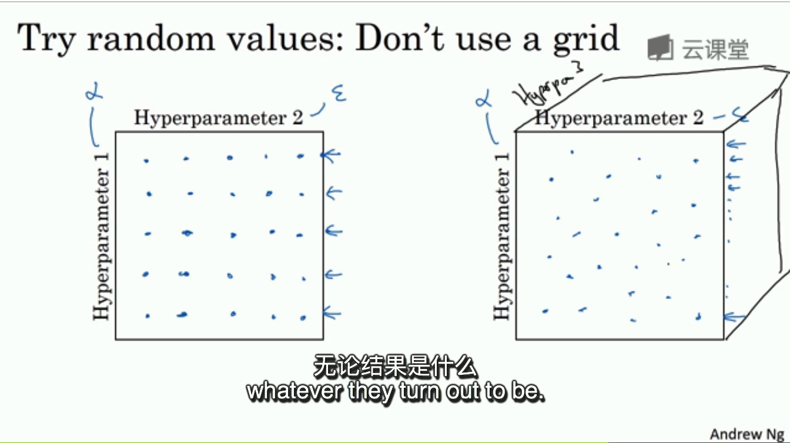
	
	* *随机取值可以提升搜索效率*选择随机数，不要选择固定间隔的参数（grid）。
	
	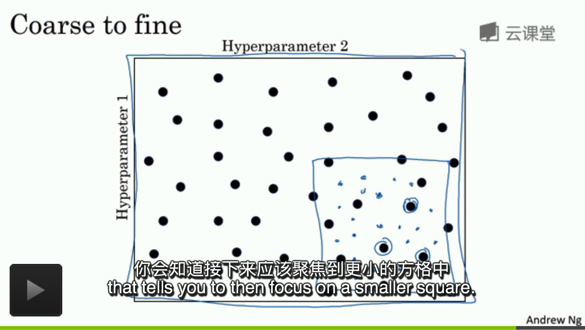
	
	* *随机取值不是在有效范围内随机均匀取值，而是选择合适的标尺scale*在整个方格里进行粗略搜索后，知道接下来应该聚焦到更小的方格中.在更小点进行更密集的选取

### 3.2 为超参数选择合适的范围

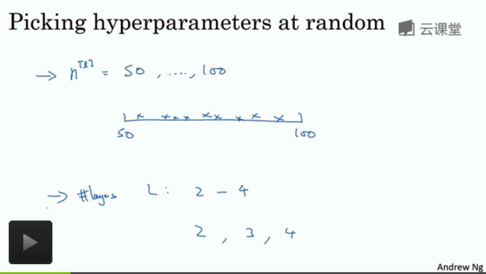

* 可以在考虑范围内随机均匀取值的超参数：
	* 隐藏层单元的数量n[l],hidden units:
		* 在范围内随机选点
	* 层数 layers L:
		* 假设选择2-4层

----
* 在有效范围内选择合适的scale，用于探究超参数。
	
	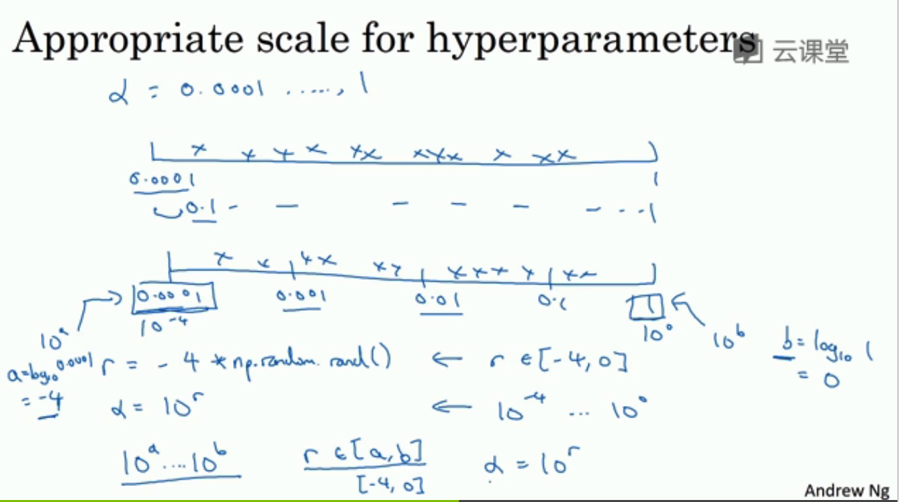
	
	* alfa
		* 假设选址范围[0.0001,1]
		* 如果随机取，90%落在0.0001-0.1之间
		* 选取scale=0.0001,0.001,0.01,0.1,1
		* r=-4 * np.random.rand()===>r=[-4,0]
		* alfa=10^r ======> 10^-4……10^0

		* r属于[a,b]...a=log10_0.0001....b=log10_1
		* alfa=[10^a,10^b]

	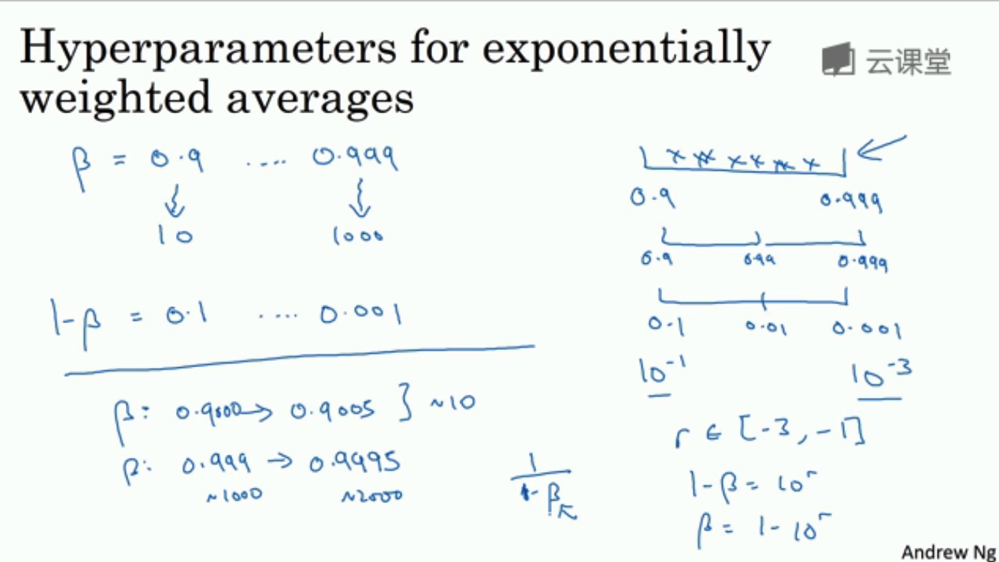

	* beta
		* 假设搜索范围beta=[0.9,0.999]
		* 考虑1-beta 解决。1-beta=[0.1,0.001]
		* a=-1,b=-3
		* 1-beta=10^r.....beta=1-10^r
### 3.3 超参数训练的实践：Pandas VS Caviar

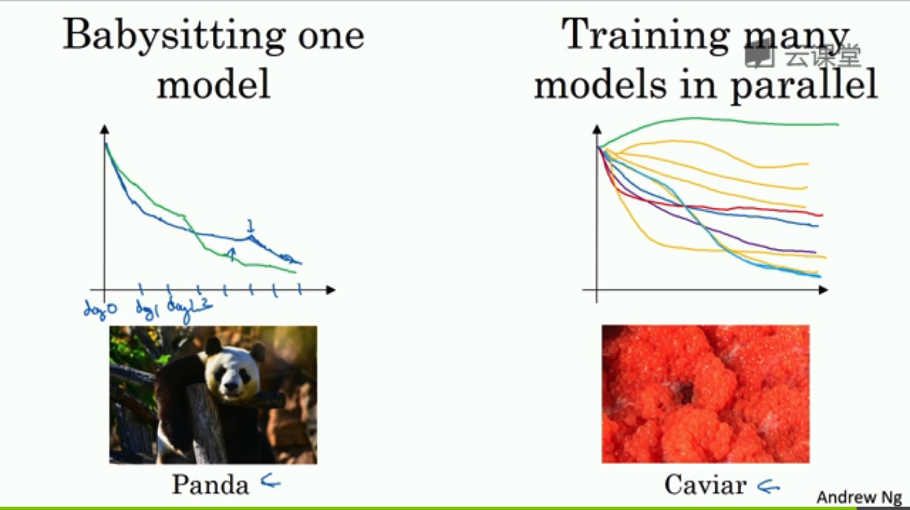

* 如何组建超参数搜索过程，有两种重要的思想流派（哺乳类动物和鱼类繁衍方式不同）
	* 熊猫模式：在计算资源有限的情况下，只训练一个模型，每天调整一个参数看这个模型走势，慢慢调。象婴儿照料一个模型
	* 鱼子酱模式：设置不同的超参数，同时训练多个模型，看哪个厉害。

### 3.4 正则化网络的激活函数

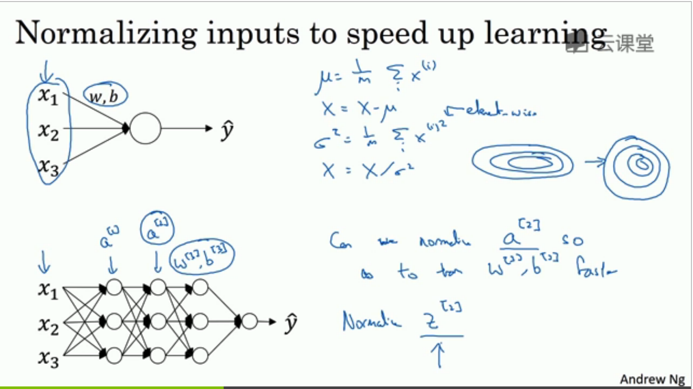

* 要训练w_2,b_2,一般normalization z_2（输入值未非线性化）

* `batch normalization`
	* 使超参数搜索变得容易许多。
	* 使神经网络对超参数的选择更加稳定
	* 超参数的范围会更庞大，并加速试验过程

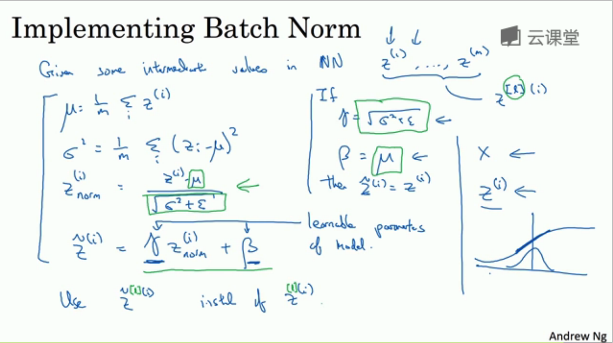

* gama/beta 控制normalization的方差和平均值。

### 3.5 将 Batch Norm 拟合进神经网络

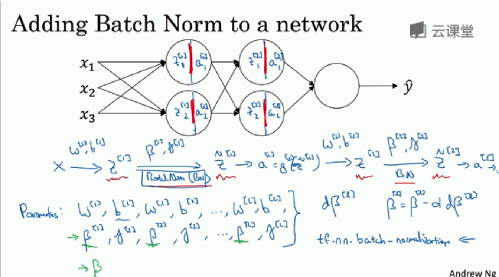

* 得到z_1后，将他batchNorm（bn归一化）（依据garma／beta两参数对它归一化）变成z_tilde
* normilazation的beta与用于momentum/adam/rmsprop算法的beta不一样。只是两个作者都用beta
* 要训练的参数救变成w/b/gama/beta........

* 因为计算normalizate时需要-平均数，所以b常数通常可以忽略不用管。
* z=w*a     z_nor=     z_~=gamar * z_nor +beta

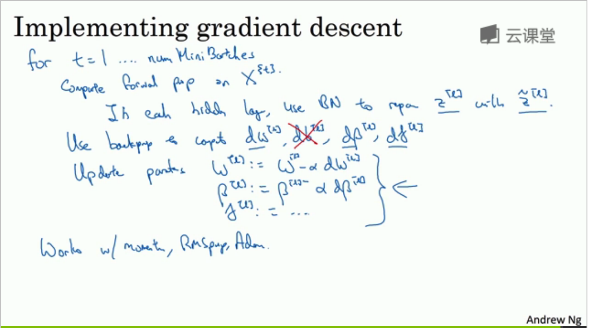

* 如何在minibatch实现batch——norm？
	* 首先对于每一个minibatch，计算每一个batch的前向反馈计算。
		* 使用z_~代替 z
	* 使用反向计算dw,dbeta,dgarma
	* 更新 w=w-alfa * dw.  beta=beta-alafa * dbeta, gama=gama-alfa * dgarma

### 3.6 Batch Norm 为什么奏效？

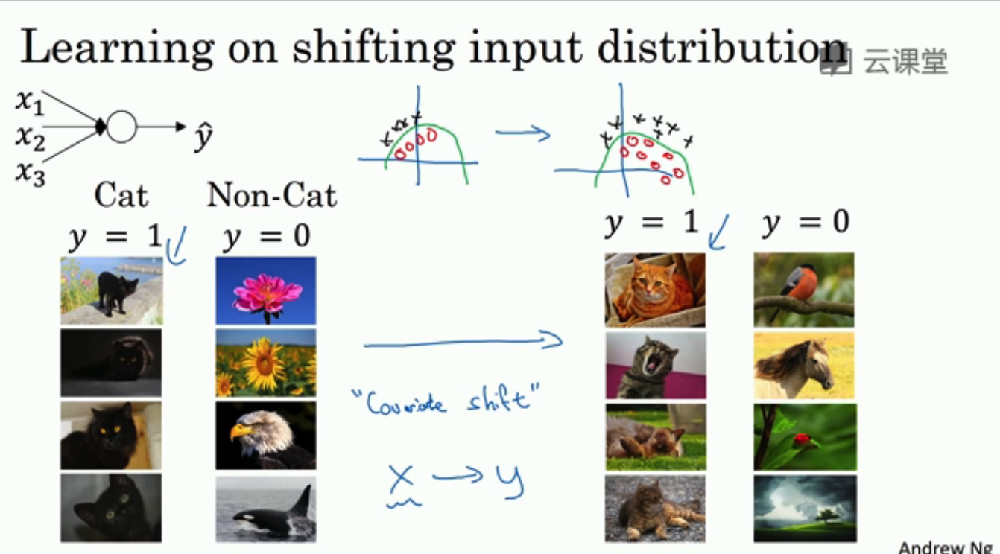

* 削减了前层参数对后层参数的影响，避免了covariate shift的问题
* 归一化保证了即使前层参数数值变化，他们的均值和方差都不变，都必须由beta/garma决定

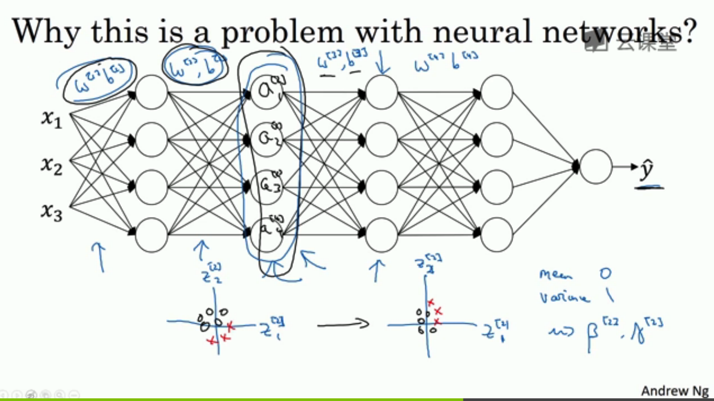

* 归一化还有轻微的正则化效果
* 1、只计算单个minibatch的平均值和方差。不是计算所有，有噪点
* 所以z也有噪点
* 所以和dropout相似，因为给隐藏单元添加了噪点，以迫使后部单元不过分依赖任何一个隐藏单元，类似于dropout，他给隐藏层增加了噪点。

### 3.7 测试时的 Batch Norm

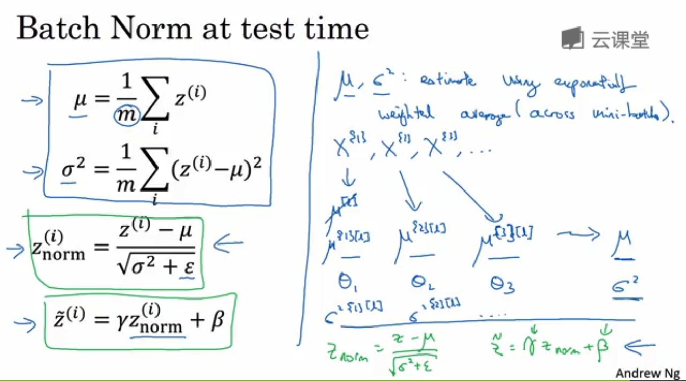

* 估算测试集隐藏单元z的值
* 测试时不能计算minibatch的平均值和方差，所以需要单独估算平均值和方差。方法就是根据训练集估算，估算的方式有很多种，理论上你可以在最终的网络中运行整个训练集来得到平均数和方差。但在实际操作中，我们通常运用指数加权平均来追逐在训练过程中你看到的平均值和方差。

### 3.8 Softmax 回归

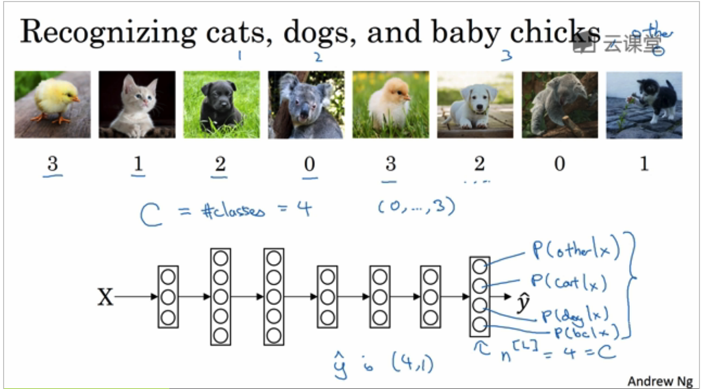

* 设定c等于类别的个数。模型最后一层输出c个数。每个数就是该类别出现的概率p(cat|x)。所以y_大小时（4，1），且所有值加起来是1.

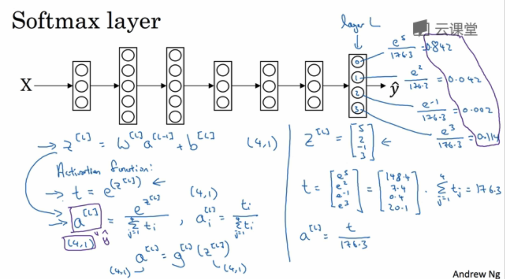

*	z=wa+b
*  t=e^z--->(4,1)
*  a=e^z/sum(t)
*  假设
* z=[5,2,-1,3],t=[e^5,e^2,e^-1,e^3]=[148.4,7.4,0.4,20.1],sum(t)=176.3,a=t/176.3

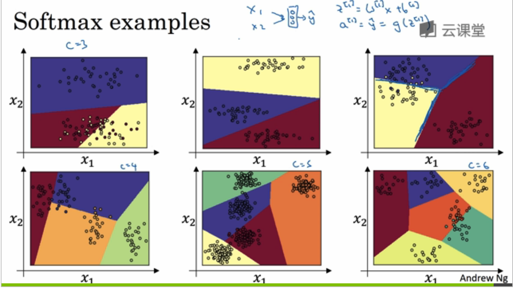

### 3.9 训练一个 Softmax 分类器

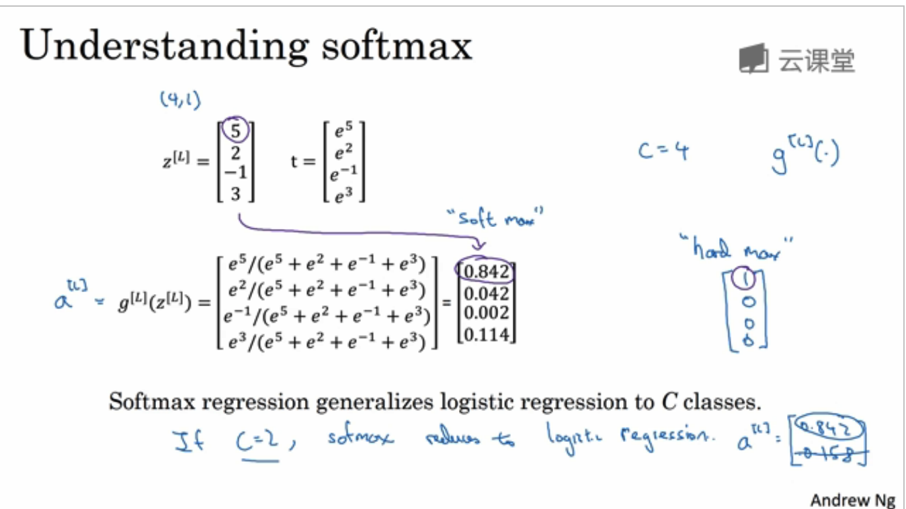

* softmax 与hardmax 相对应【1 0 0 0 0】。softmax映射更温柔。

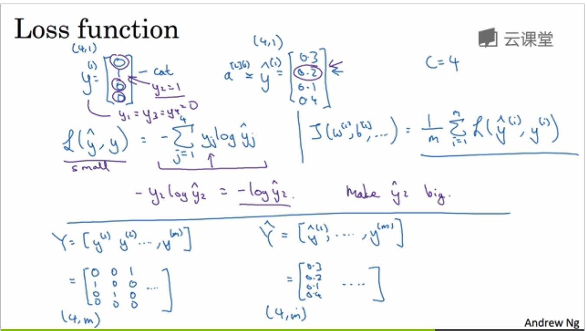

* softmax的loss fuction。L(y_ ,y)=-sum(y * logy_)
* 由于y只有一个是1，其它都是0.所以上述公式其实即刻系-logy_，即使y_尽可能变大，y_最大就是1。其实这个就是最大似然估计。
* J(....)=1/m*L(y_,y)

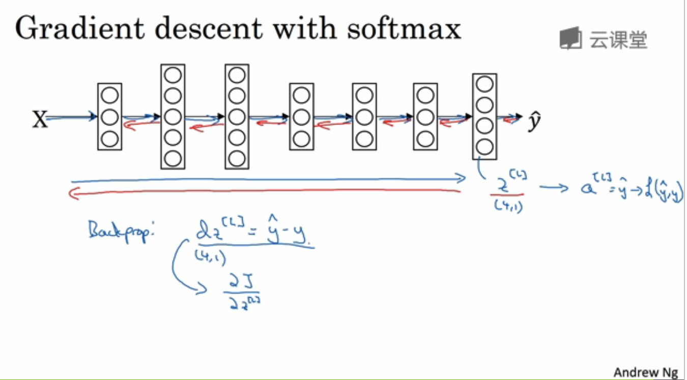

* softmax梯度下降，一样。先前向，再反向。

### 3.10 深度学习框架

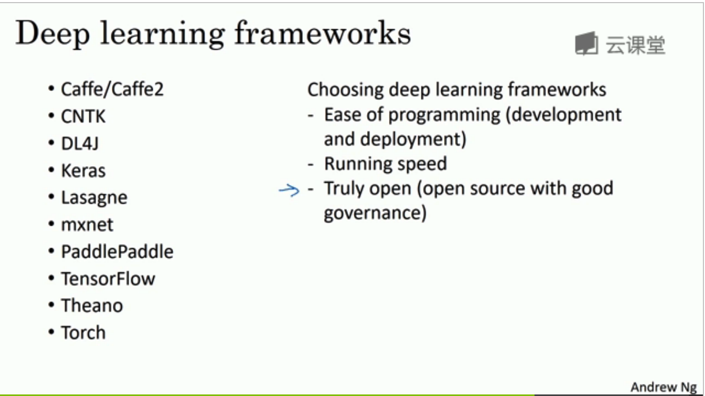

### 3.11 TensorFlow

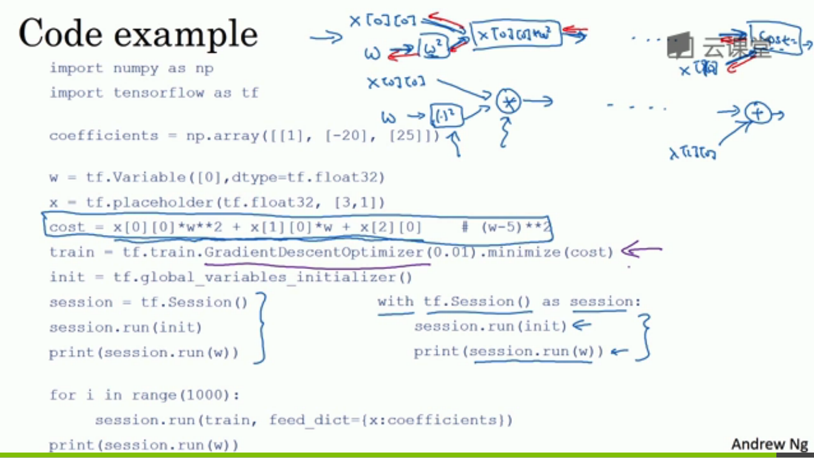

