# deeplearning_notes

-----------------

## 第一周 卷积神经网络

### 1.1 计算机视觉

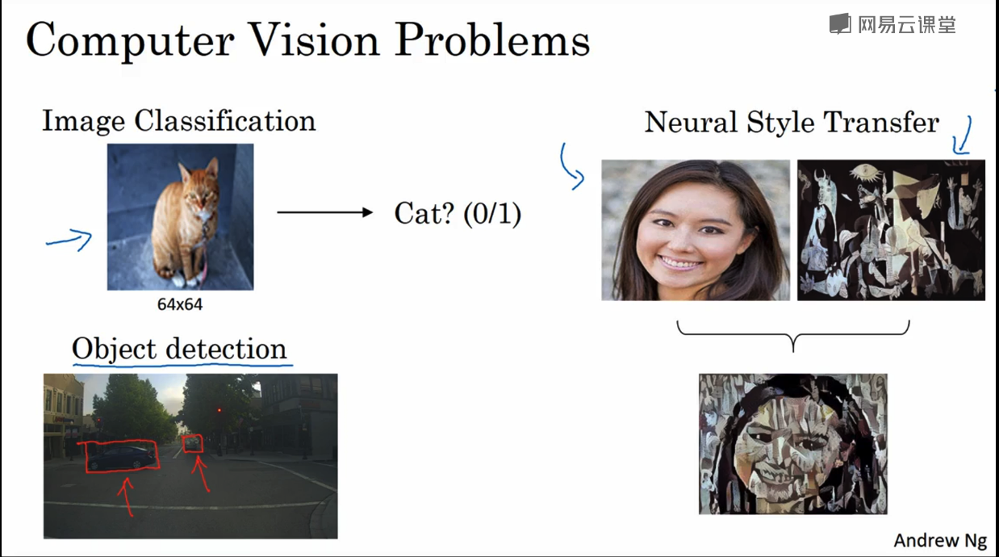

* 计算机视觉问题：图像分类/对象识别/神经风格转移

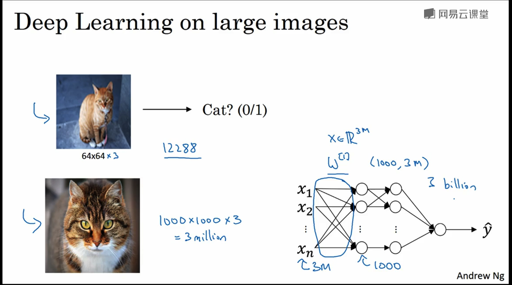

* 如果图片尺寸大，特征就会非常多，需要计算的权重就超级多。
* 所要要处理大图片就要卷积运算

### 1.2 边缘检测示例

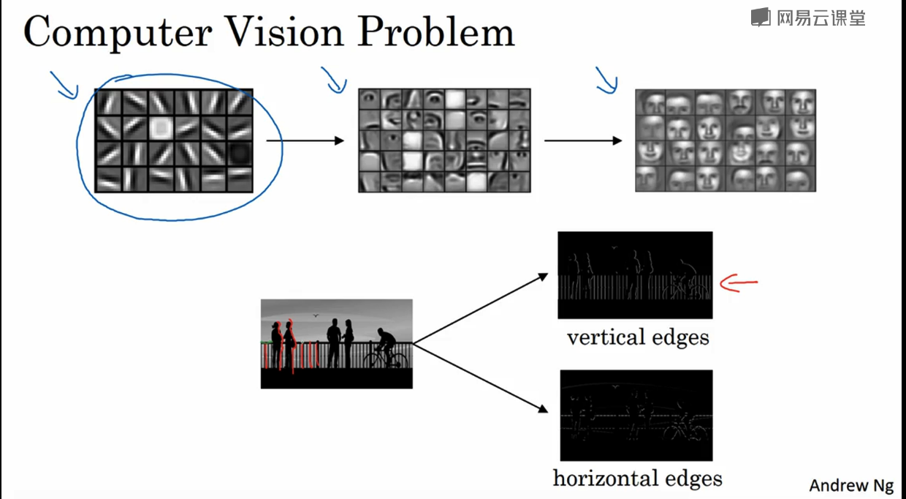

* 检测直线/横线

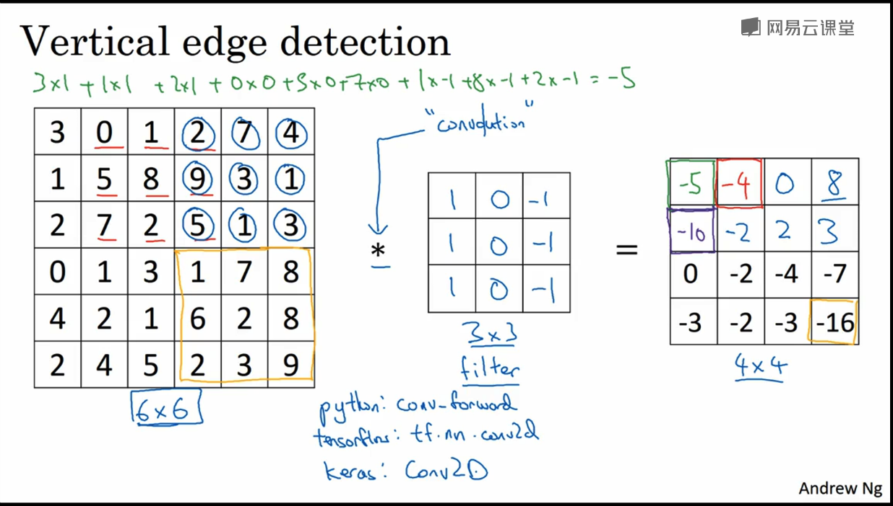

* 构造一个3*3的矩阵（filter）对6 * 6的图片卷积
* 垂直边缘检测

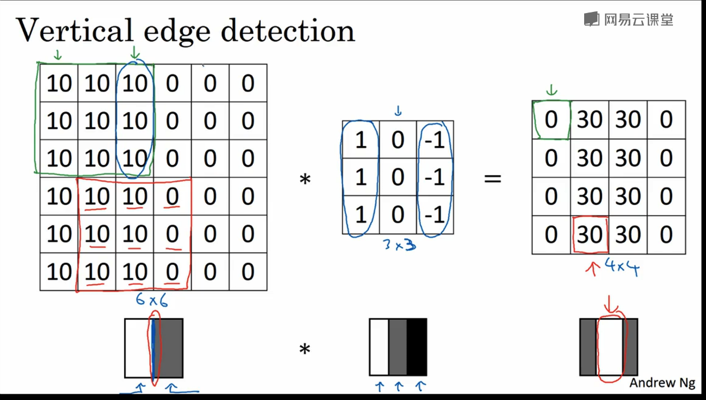

* 检测边缘（白色）。因为图片小，所以边缘粗。

### 1.3 更多边缘检测内容

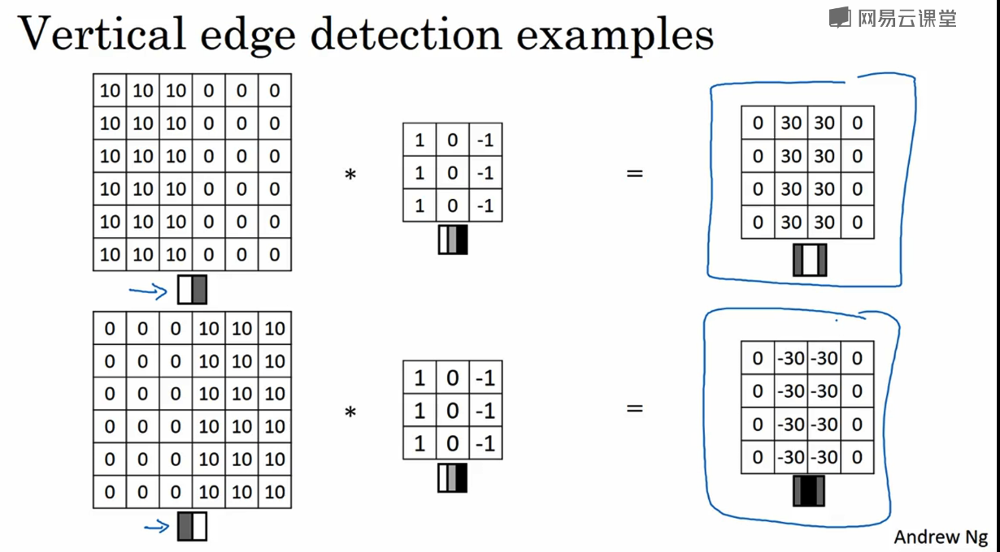

* 正边/负边

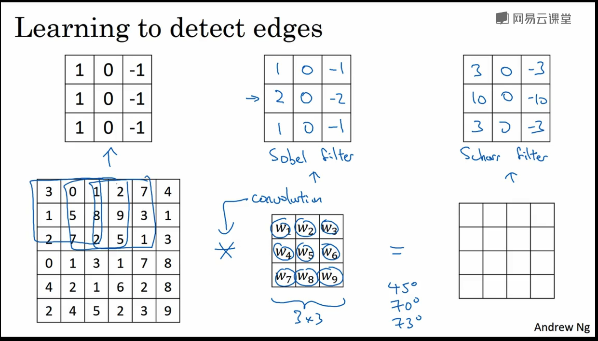

### 1.4 Padding

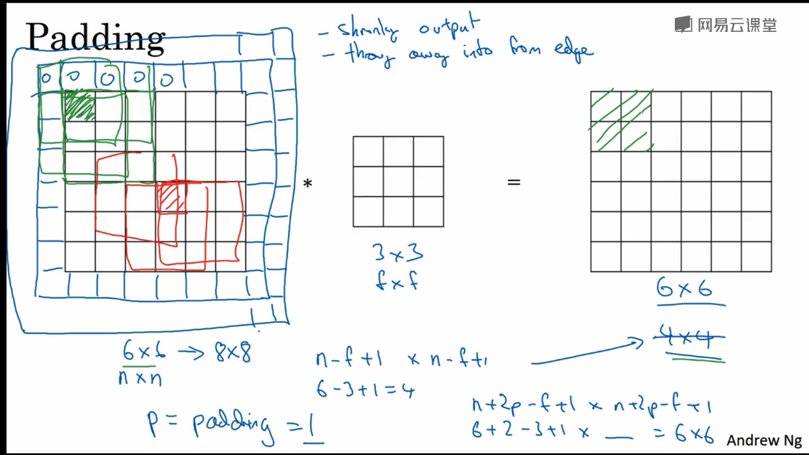

* n+2*p-f+1

* valid不填充. n * n  f * f. ---> n-f+1. n-f+1
* same.填充。  --->n+2p-f+1

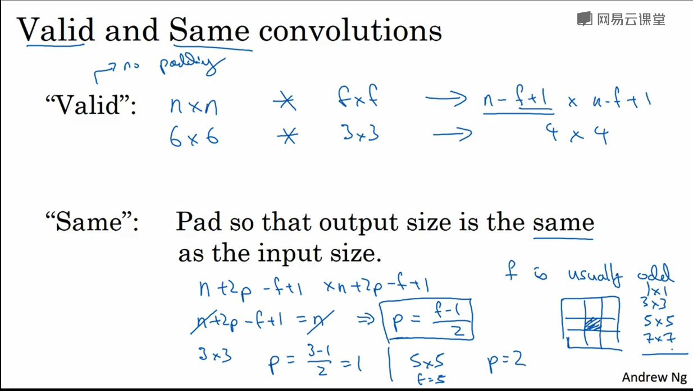

### 1.5 卷积步长

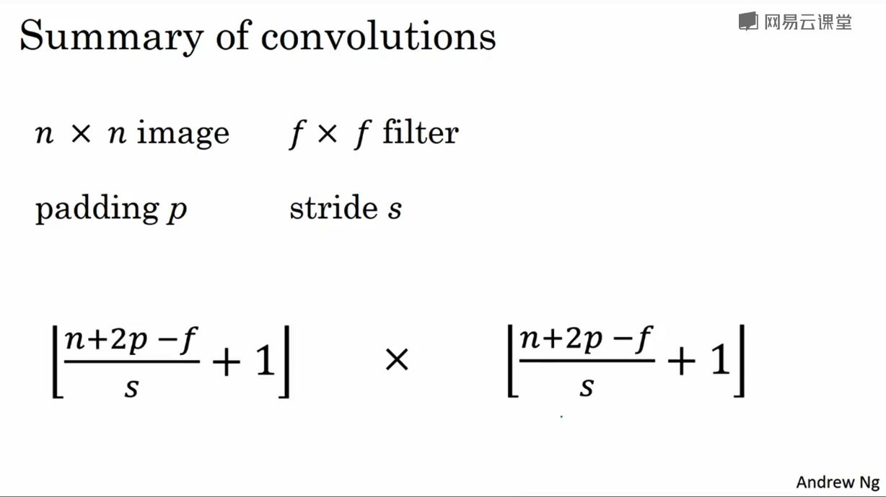

* (n+2p-f)/s +1....s是步长

* 按照机器学习概念，通常不做翻转。所以严格来说不是卷积。只是cross-correlation

### 1.6 卷积中“卷”的体现之处

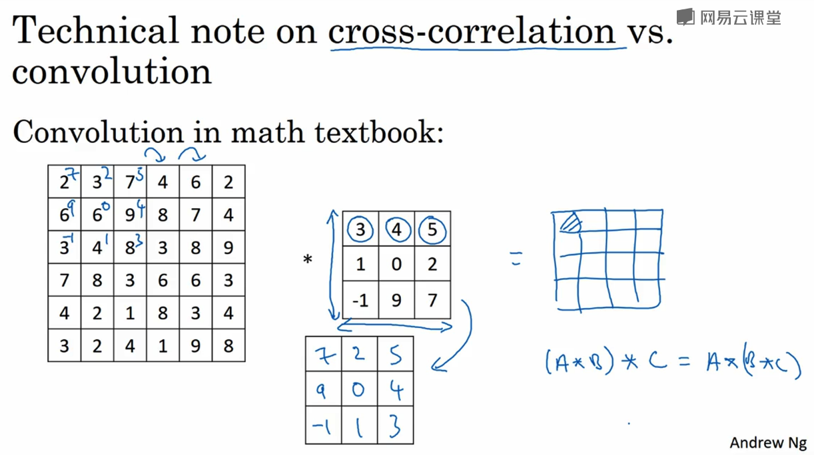

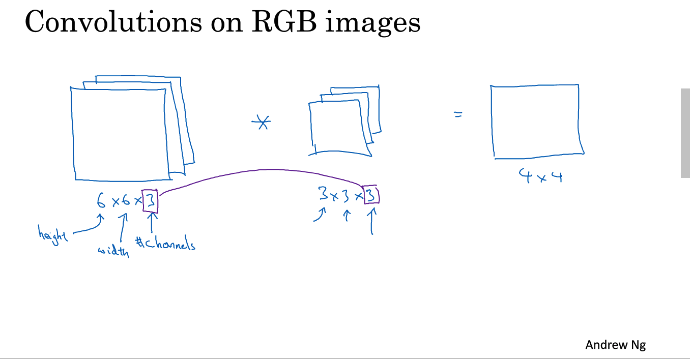

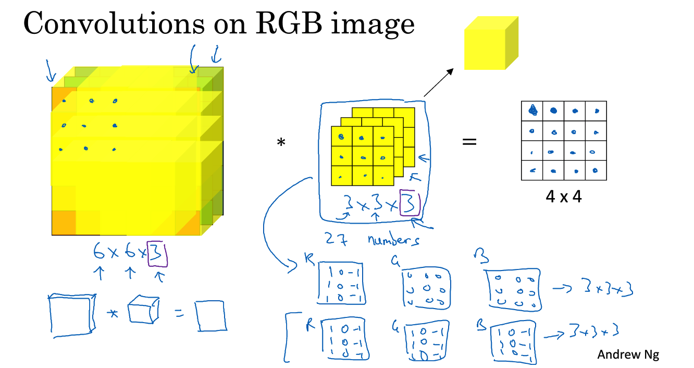

### 1.7 单层卷积网络

* 避免overfit

### 1.8 简单卷积网络示例

### 1.9 池化层

### 1.10 卷积神经网络示例

### 1.11 为什么使用卷积？

## 第二周 深度卷积网络：实例探究

### 2.1 为什么要进行实例探究？

### 2.2 经典网络

### 2.3 残差网络

### 2.4 残差网络为什么有用？

### 2.5 网络中的网络以及 1×1 卷积

### 2.6 谷歌 Inception 网络简介

### 2.7 Inception 网络

### 2.8 使用开源的实现方案

### 2.9 迁移学习

### 2.10 数据扩充

### 2.11 计算机视觉现状

## 第三周 目标检测

### 3.1 目标定位

### 3.2 特征点检测

### 3.3 目标检测

### 3.4 卷积的滑动窗口实现

### 3.5 Bounding Box 预测

### 3.6 交并比

### 3.7 非极大值抑制

### 3.8 Anchor Boxes

### 3.9 YOLO 算法

###3.10 （选修）RPN 网络

## 第四周 特殊应用：人脸识别和神经风格转换

###4.1 什么是人脸识别？

###4.2 One-Shot 学习

###4.3 Siamese 网络

###4.4 Triplet 损失

###4.5 面部验证与二分类

###4.6 什么是神经风格转换？

###4.7 什么是深度卷积网络？

###4.8 代价函数

###4.9 内容代价函数

###4.10 风格损失函数

###4.11 一维到三维推广
